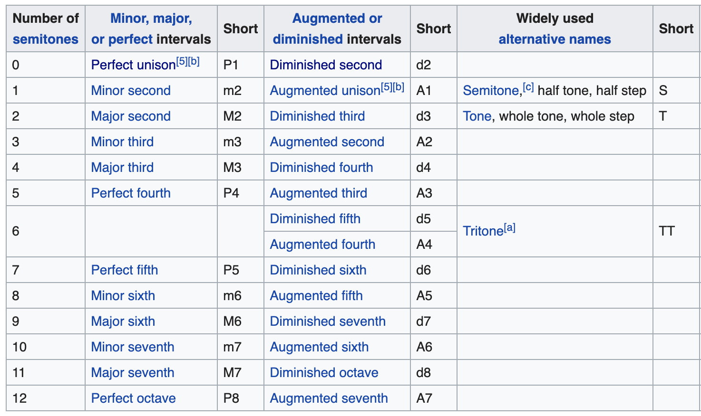

# 音程

摘自[wikipedia](https://en.wikipedia.org/wiki/Interval_(music))

| 半音数 | Minor/major/perfect | 简称 | 例子    | Augmented/diminished | 简称 | 例子     |
| ------ | ------------------- | ---- | ------- | -------------------- | ---- | -------- |
| 0      | Perfect unision     | P1   | C-C     | Diminished second    | d2   | C-Dbb    |
| 1      | Minor second        | m2   | C-Db    | Augmented unision    | A1   | C-C#     |
| 2      | Major second        | M2   | C-D     | Diminished third     | d3   | C-Ebb    |
| 3      | Minor third         | m3   | C-Eb    | Augmented second     | A2   | C-D#     |
| 4      | Major third         | M3   | C-E     | Diminished fourth    | d4   | C-Fb     |
| 5      | Perfect fourth      | P4   | C-F     | Augmented third      | A3   | C-E#     |
| 6      |                     |      |         | Diminished fifth     | d5   | C-Gb     |
| 6      |                     |      |         | Augmented fourth     | A4   | C-F#     |
| 7      | Perfect fifth       | P5   | C-G     | Diminished sixth     | d6   | C-Ab     |
| 8      | Minor sixth         | m6   | C-Ab    | Augmented fifth      | A5   | C-G#     |
| 9      | Major sixth         | M6   | C-A     | Diminished seventh   | d7   | C-highBb |
| 10     | Minor seven         | m7   | C-Bb    | Augmented sixth      | A6   | C-highA# |
| 11     | Major seven         | M7   | C-B     | Diminished octave    | d8   | C-highCb |
| 12     | Perfect octave      | P8   | C-highC | Augmented seventh    | A7   | C-highB# |

| 半音数 | 大调 | 小调 |
| ------ | ---- | ---- |
| 0      | C    | A    |
| 1      |      |      |
| 2      | D    | B    |
| 3      |      | C    |
| 4      | E    |      |
| 5      | F    | D    |
| 6      |      |      |
| 7      | G    | E    |
| 8      |      | F    |
| 9      | A    |      |
| 10     |      | G    |
| 11     | B    |      |
| 12     | C    | A    |

| 差多少半音 | C   | D   | E   | F   | G   | A   | B   | highC |
| ---------- | --- | --- | --- | --- | --- | --- | --- | ----- |
| C          | 0   | 2   | 4   | 5   | 7   | 9   | 11  | 12    |
| D          |     | 0   | 2   | 3   | 5   | 7   | 9   | 10    |
| E          |     |     | 0   | 1   | 3   | 5   | 7   | 8     |
| F          |     |     |     | 0   | 2   | 4   | 6   | 7     |
| G          |     |     |     |     | 0   | 2   | 4   | 5     |
| A          |     |     |     |     |     | 0   | 2   | 3     |
| B          |     |     |     |     |     |     | 0   | 1     |
