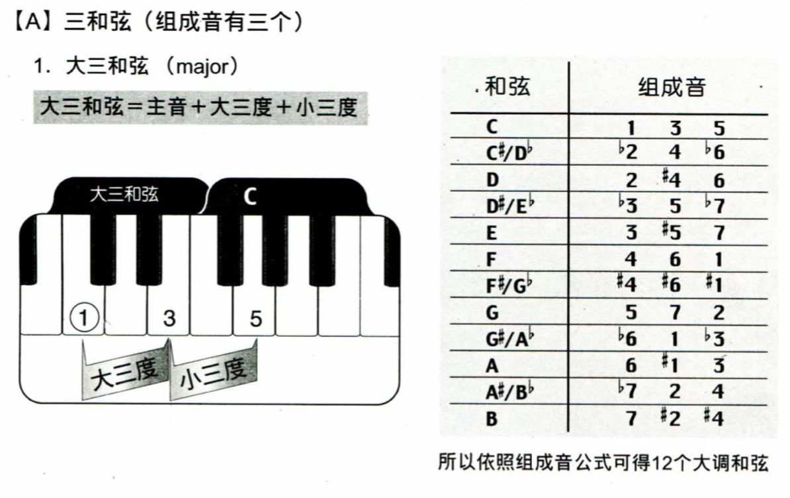
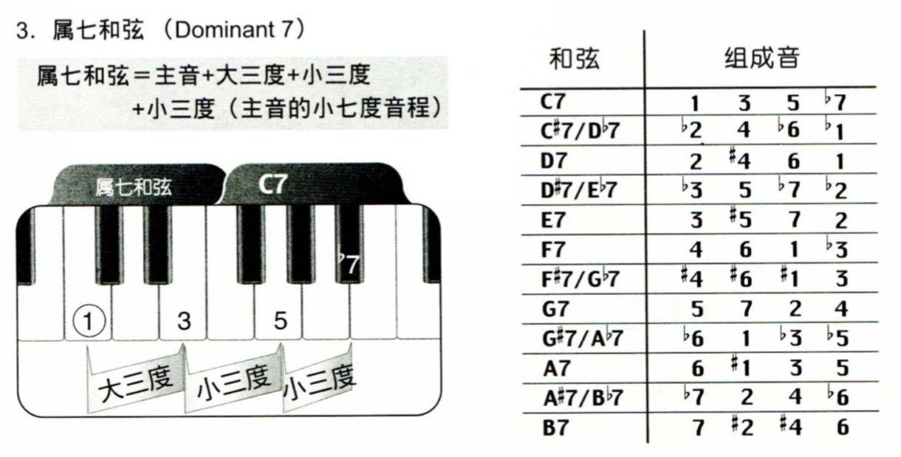
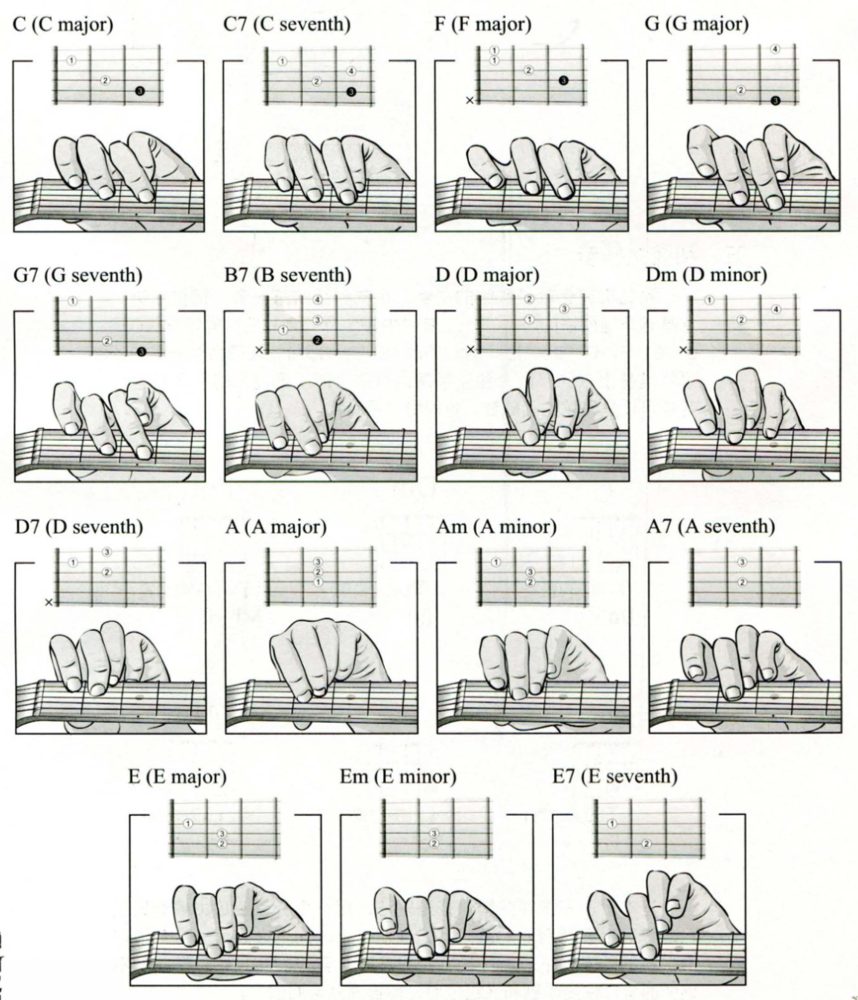

# 和弦
## Major Triad

## minor Triad

## Diminished Triad /Augmented Triad

## Major 7

## Minor 7

## Dominant 7

## 和弦图

## 初学者必学的和弦

## 和弦计算

| Major Triad | 音名          | 简谱记号      |
| ----------- | ------------- | ------------- |
| C           | C - E - F     | 1 - 3 - 5     |
| C#          | C# - E# - F#  | #1 - #3 - #5  |
| Db          | Db - F - Ab   | b2 - 4 - b6   |
| D           | D - F# - A    | 2 - #4 - 6    |
| D#          | D# - F## - A# | #2 - ##4 - #6 |
| Eb          | Eb - G - Bb   | b3 - 5 - b7   |
| E           | E - G# - B    | 3 - #5 - 7    |
| F           | F - A - C     | 4 - 6 - 1     |
| F#          | F# - A# - C#  | #4 - #6 - #1  |
| Gb          | Gb - Bb - Db  | b5 - b7 - b2  |
| G           | G - B - D     | 5 - 7 - 2     |
| G#          | G# - B# -D#   | #5 - #7 -  #2 |
| Ab          | Ab - C - Eb   | b7 - 1 - b3   |
| A           | A - C# - E    | 6 - #1 - 3    |
| A#          | A# - C## - E# | #6 - ##1 - #3 |
| Bb          | Bb - D - F    | b7 - 2 - 4    |
| B           | B - D# - F#   | 7 - #2 - #4   |

| Minor Triad | 音名          | 简谱记号      |
| ----------- | ------------- | ------------- |
| Cm          | C - bE - G    | 1 - b3 - 5    |
| C#m         | C# - E - G#   | #1 - 3 - #5   |
| Dbm         | Db - Fb - Ab  | b2 - b4 - b6  |
| Dm          | D - F - A     | 2 - 4 -6      |
| D#m         | D# - F# - A#  | #2 - #4 - #6  |
| Ebm         | Eb - Gb - Bb  | b3 - b5 - b7  |
| Em          | E - G - B     | 3 - 5 - 7     |
| Fm          | F - bA - C    | 4 - b6 - 1    |
| F#m         | F# - A - C#   | #4 - 6 - #1   |
| Gbm         | Gb - Bbb - Db | b5 - bb7 - b2 |
| Gm          | G - Bb - D    | 5 - b7 - 2    |
| G#m         | G# - B - D#   | #5 - 7 - #2   |
| Abm         | Ab - Cb - Eb  | b6 - b1 - b3  |
| Am          | A - C - E     | 6 - 1 - 3     |
| A#m         | A# - C# - E#  | #6 - #1 - #3  |
| Bbm         | Bb - Db - F   | b7 - b2 - 4   |
| Bm          | B - D - F#    | 7 - 2 - #4    |
