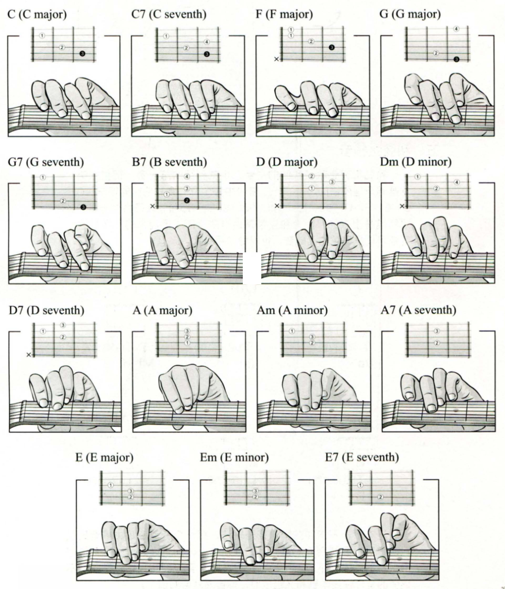

# 初学者必学的和弦

| 和弦 | 组成音    | 简谱      | 6弦 | 5弦 | 4弦 | 3弦 | 2弦 | 1弦 |
| ---- | --------- | --------- | --- | --- | --- | --- | --- | --- |
| C    | C-E-G     | 1-3-5     | E   | C   | E   | G   | C   | E   |
| C7   | C-E-G-Ab  | 1-3-5-b7  | E   | C   | E   | Ab  | C   | E   |
| F    | F-A-C     | 4-6-1     |     | C   | F   | A   | C   | F   |
| G    | G-B-D     | 5-7-1     | G   | B   | D   | G   | B   | G   |
| G7   | G-B-D-F   | 5-7-1-3   | G   | B   | D   | G   | B   | F   |
| B7   | B-D#-F#-A | 7-#2-#4-6 |     | B   | D#  | A   | B   | F#  |
| D    | D-F#-A    | 2-#4-6    |     | A   | D   | A   | D   | F#  |
| Dm   | D-F-A     | 2-4-6     |     | A   | D   | A   | D   | F   |
| D7   | D-F#-A-C  | 2-#4-6-1  |     | A   | D   | A   | C   | F#  |
| A    | A-C#-E    | 6-#1-3    | E   | A   | E   | A   | C#  | E   |
| Am   | A-C-E     | 6-1-3     | E   | A   | E   | A   | C   | E   |
| A7   | A-C#-E-G  | 6-#1-3-5  | E   | A   | E   | G   | C#  | E   |
| E    | E-G#-B    | 3-#5-7    | E   | B   | E   | G#  | B   | E   |
| Em   | E-G-B     | 3-5-7     | E   | B   | E   | G   | B   | E   |
| E7   | E-G#-B-D  | 3-#5-7-2  | E   | B   | D   | G#  | B   | E   |
