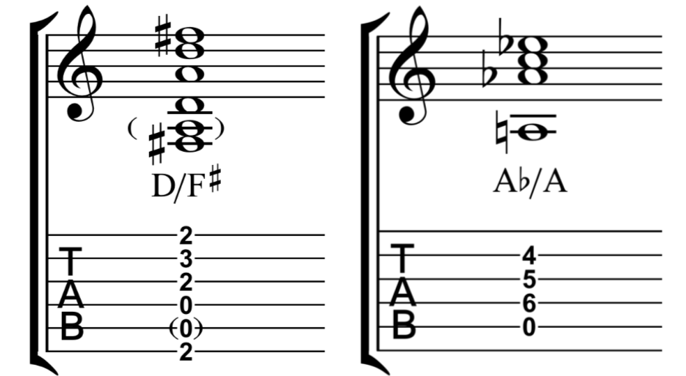

# 进阶和弦
## 和弦图

## 和弦汇总

## 分割和弦 Slash Chord
> In music, especially modern popular music a slash chord or slashed chord, also compound chord, is a chord whose bass note or inversion is indicated by the addition of a slash and the letter of the bass note after the root note letter. It does not indicate "or". For example, a C major chord (C) in second inversion is written C/G or C/G bass, which reads "C slash G", "C over G" or "C over a G bass". If E were the bass it would be written C/E or C/E bass (making a major chord in first inversion), which is read "C slash E", "C over E" or C/E bass. Some chords may not otherwise be notated, such as A♭/A. Thus, a slash chord may also indicate the chord form or shape and an additional bass note.

> In popular music, where the exact arrangement of notes is less important than some other forms, slash chords are generally used only when the specific bass note is important. A common example in guitar based music is in the I-V-vi progression, in which the V chord is a passing chord. By placing the third of the V chord in the bass, a descending scale, also known as a walkdown, is created in the bass. For example, in the key of G major this would be the chords G, D/F♯, Em. That progression has the descending bassline G, F♯, E. This type of slash chord contains diatonically occurring notes. In traditional Classical notation it would be written using figured bass symbols. Another commonly-used type of slash chord in chord progressions is the minor key progression i – i/VII bass – iv/VI bass – V. In the key of A minor, this chord progression would be notated A minor, A minor/G, D Minor/F, E major (or E7). This descending bassline moving diatonically from i to V is a stock feature in popular music that is used in numerous songs.

/From Wikipedia

## 转位和弦 Inversion
> In music theory, the word inversion has distinct, but related, meanings when applied to intervals, chords, voices (in counterpoint), and melodies. The concept of inversion also plays an important role in musical set theory.

> A chord's inversion describes the relationship of its lowest notes to the other notes in the chord. For instance, a C-major triad contains the tones C, E and G; its inversion is determined by which of these tones is the lowest note (or bass note) in the chord. /

/From Wikipedia

## 掛留和弦 Suspended Chord (Suspended 4th Chord /Suspended 2nd Chord)
> A suspended chord (or sus chord) is a musical chord in which the (major or minor) third is omitted, replaced usually with either a perfect fourth or a major second although the fourth is far more common. The lack of a minor or a major third in the chord creates an open sound, while the dissonance between the fourth and fifth or second and root creates tension. When using popular-music symbols, they are indicated by the symbols "sus4" and "sus2".For example, the suspended fourth and second chords built on C, written as Csus4 and Csus2, have pitches C–F–G and C–D–G, respectively.

/From Wikipedia

## 加九和弦 Added 9th Chord
> An added ninth chord is a major triad with an added ninth. Thus, Cadd9 consists of C, E, G and D. (The D, which might be called an added second, is two fifths up from the root.) Added ninth chords differ from other ninth chords because the seventh is never included.

/From Wikipedia

## Diminished Triad /Augmented Triad 增三和弦/减三和弦

## 增三和弦

## 减七和弦

