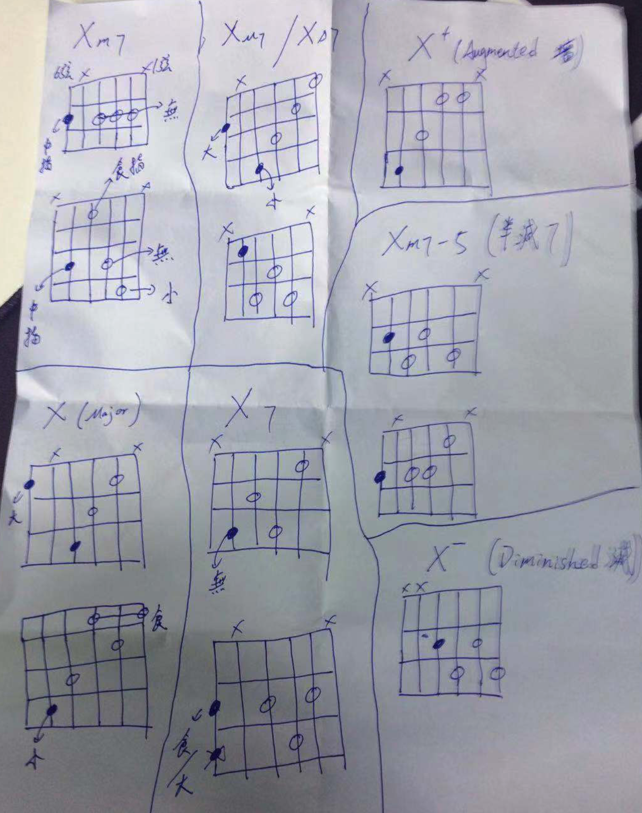

# 简化和弦

## 音程

## 简化和弦
| 和弦      | 根音在6弦               | 根音在5弦               |
| --------- | ----------------------- | ----------------------- |
| Major     |   |   |
| Major7    |  |  |
| Dominant7 |     |     |
| minor7    |  |  |

## 老师手绘

