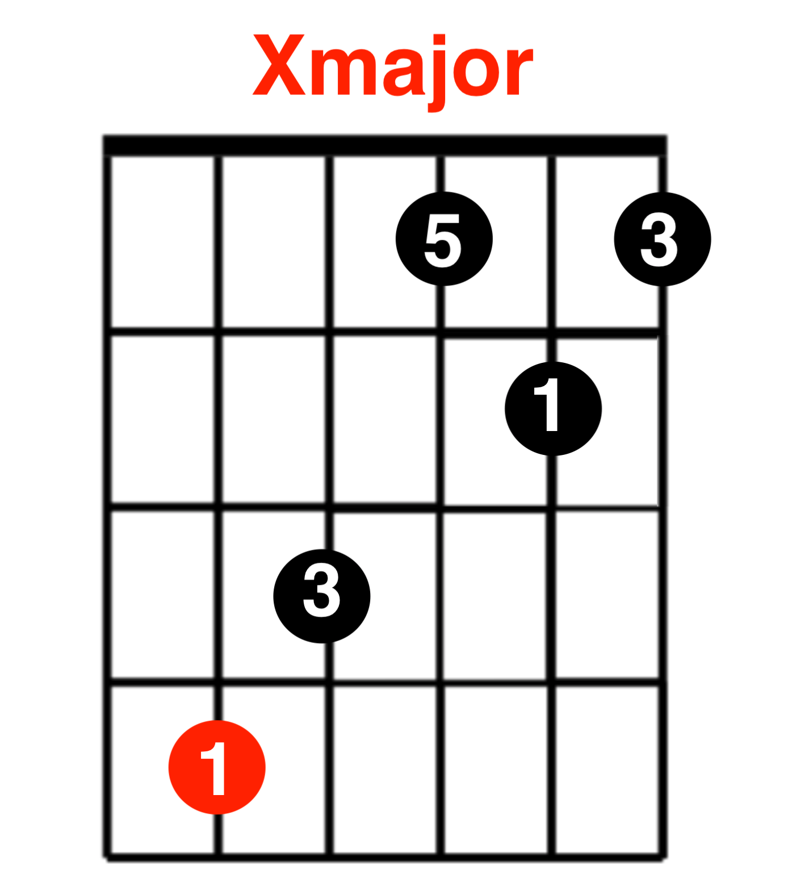
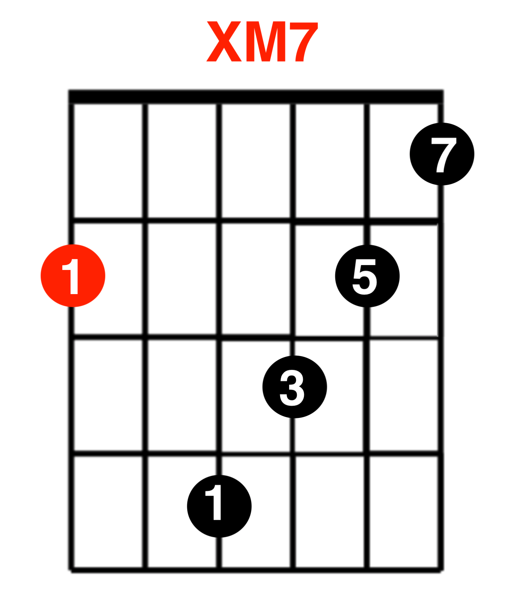
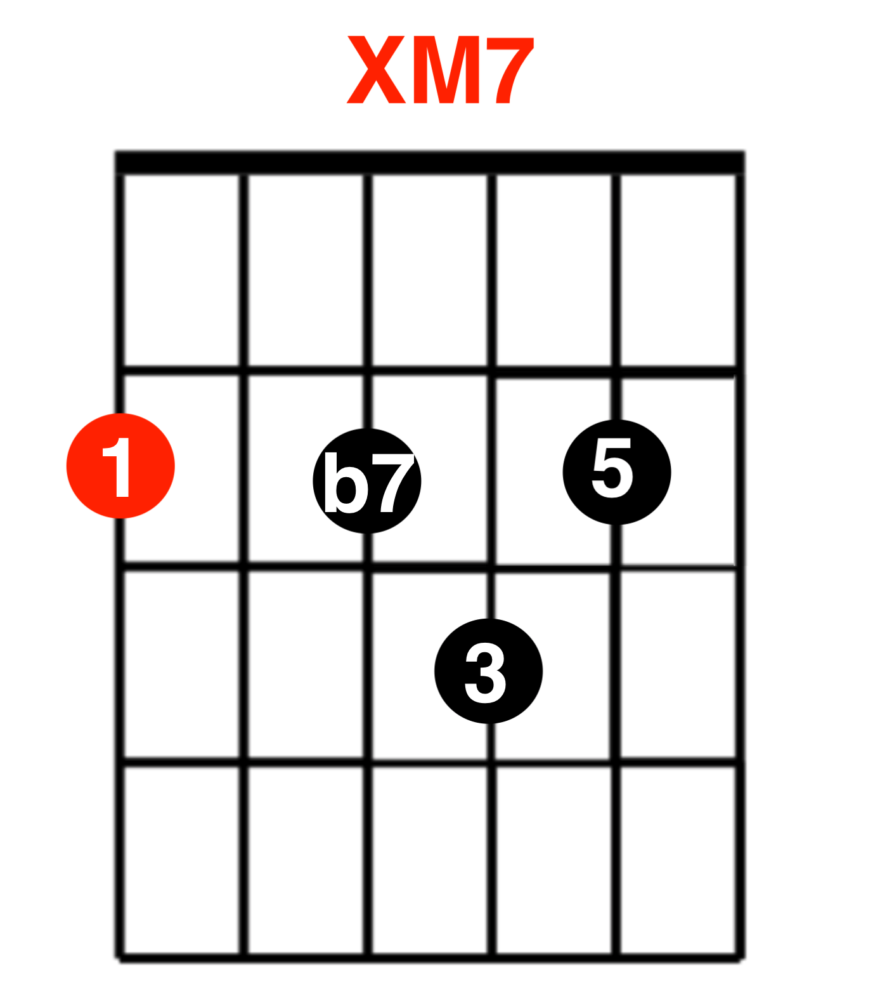
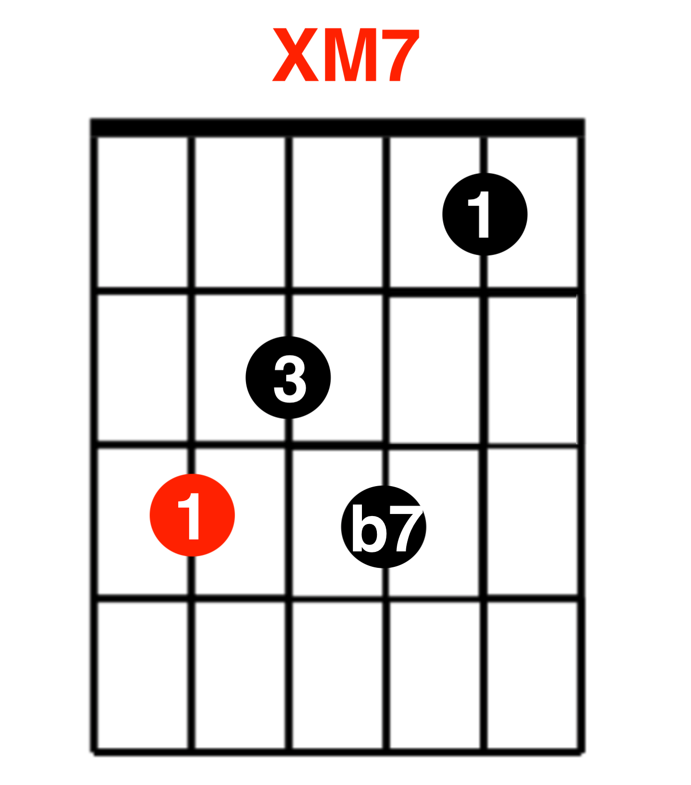
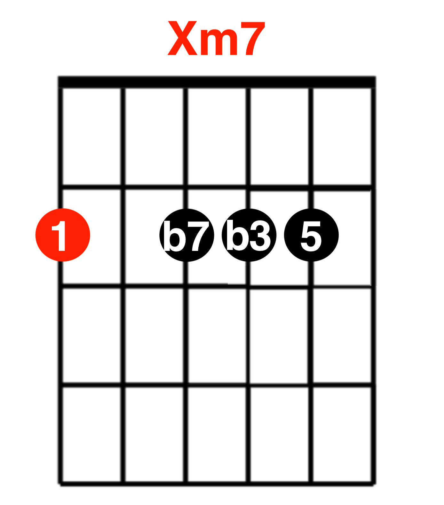
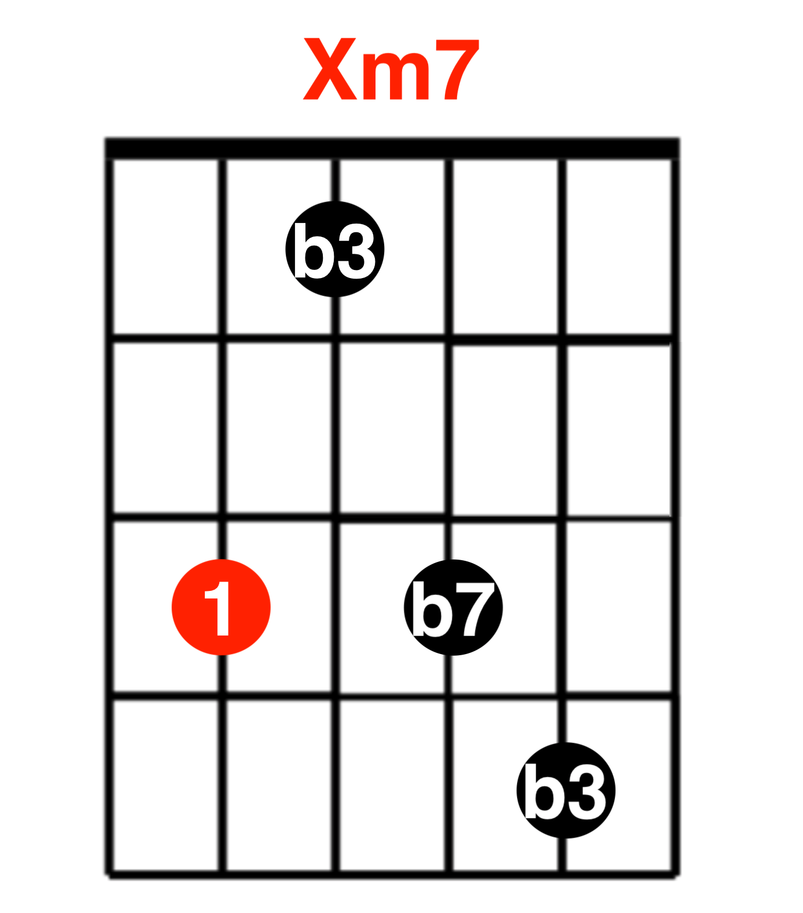

# 简化和弦

## 音程

## 简化和弦
| 和弦   | 根音在6弦                                   | 根音在5弦                                   |
| ------ | ------------------------------------------- | ------------------------------------------- |
| Major  |   |   |
| Major7 |  |  |
| 属7    |       |       |
| Minor7 |  |  |

## 老师手绘

