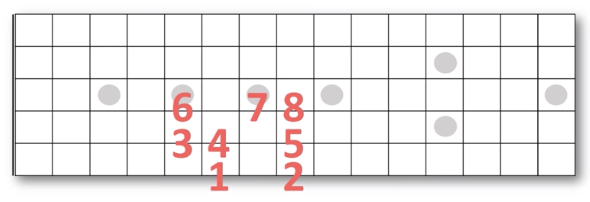
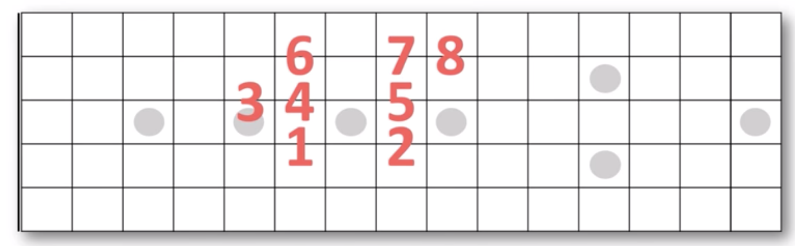

# 音程推算记忆法

## 音程形状

## 六个C和弦

## 六个Am和弦

## 参考
- [音程推算記憶法【葉宇峻彈吉他#148】](https://www.youtube.com/watch?v=SCfF4gDwSRY)
- [葉宇峻彈吉他#25 Am的基本六種按法 Minor Triad Chord Tutorial](https://www.youtube.com/watch?v=FfbP0ZlVde4&list=PL7yZwNs7cH5QmdGvL7XtnoQ6VAsDfjBXH&index=38)
- [葉宇峻彈吉他#23 C和弦的基本六種按法 Major Triad Chord Tutorial](https://www.youtube.com/watch?v=9MSbllQNW14&list=PL7yZwNs7cH5QmdGvL7XtnoQ6VAsDfjBXH&index=39)
