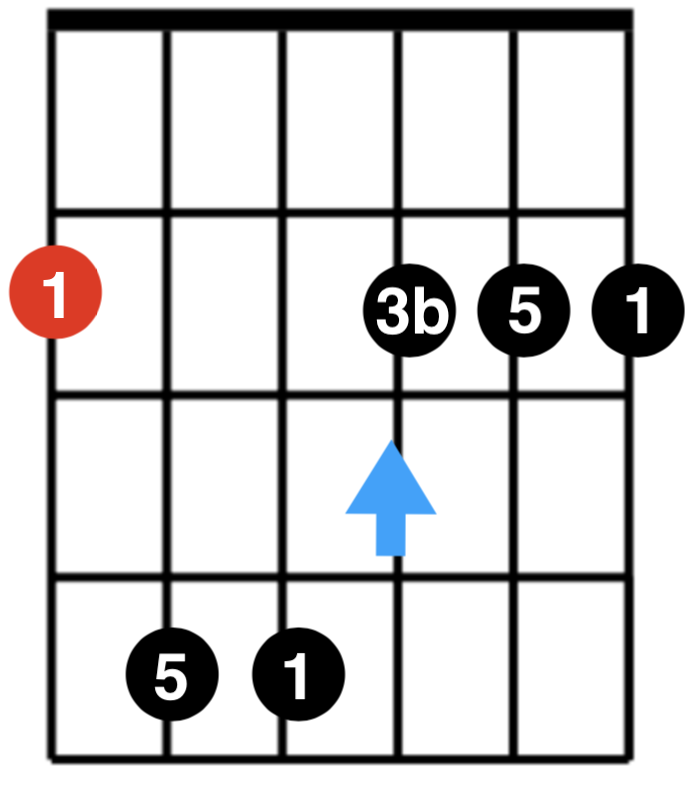
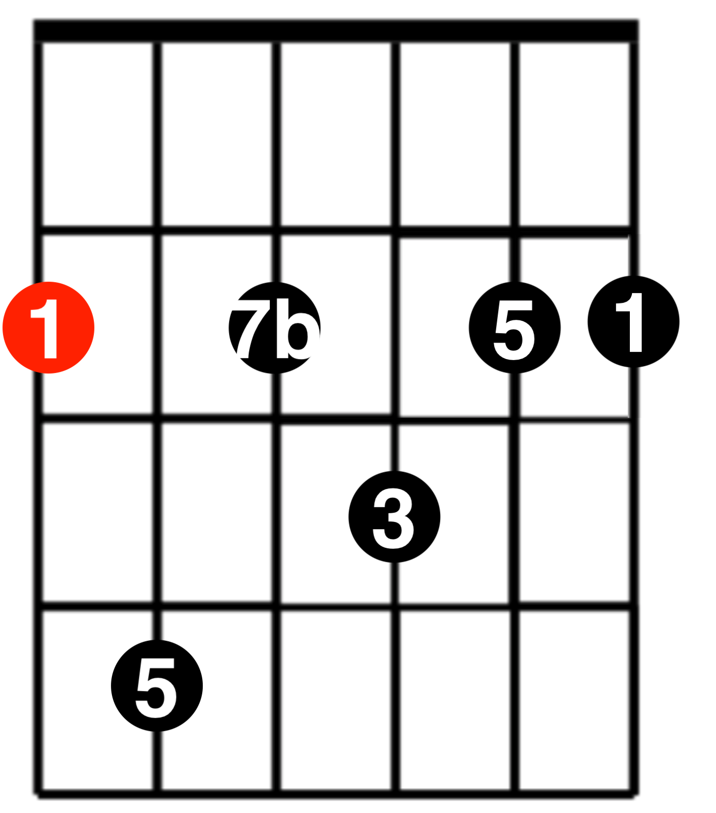
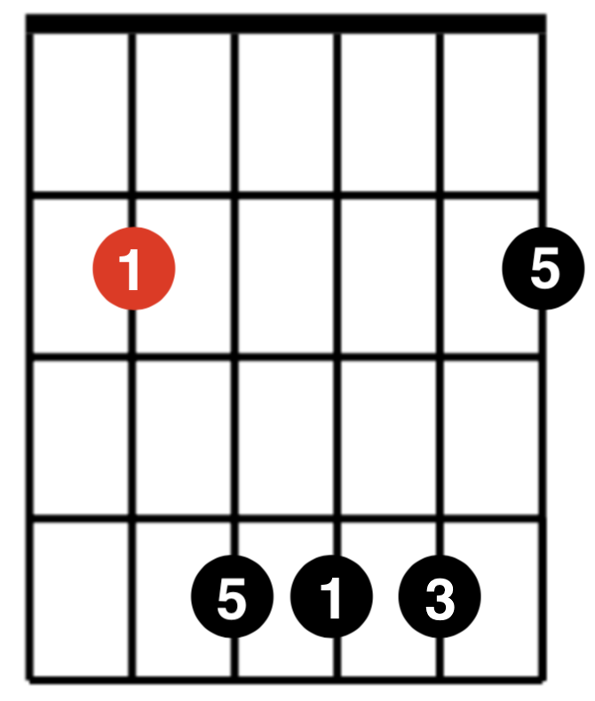
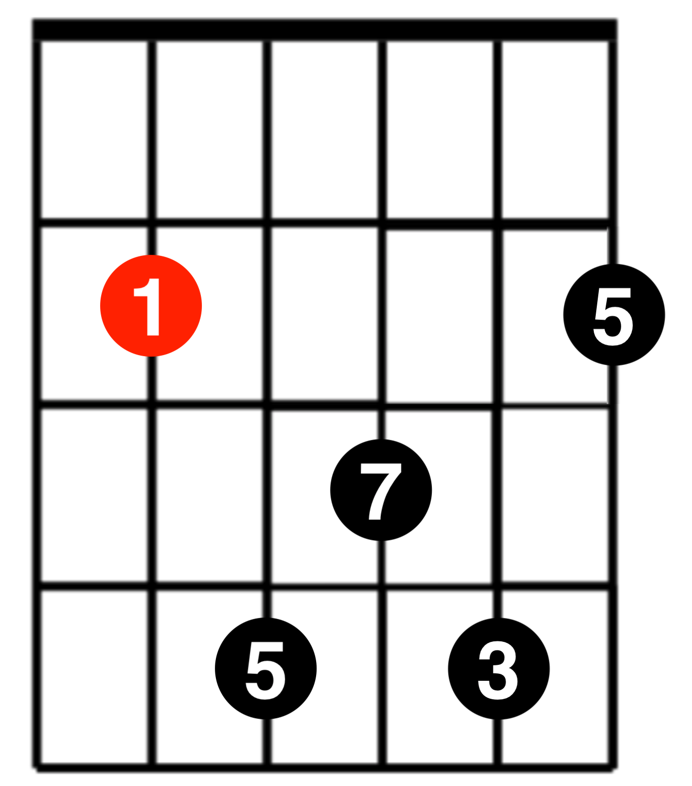
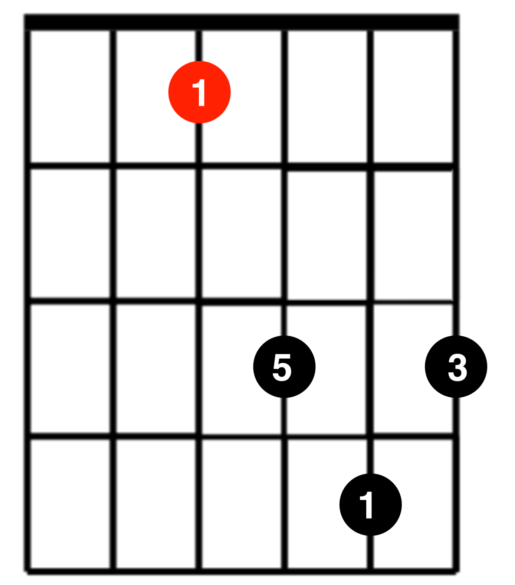
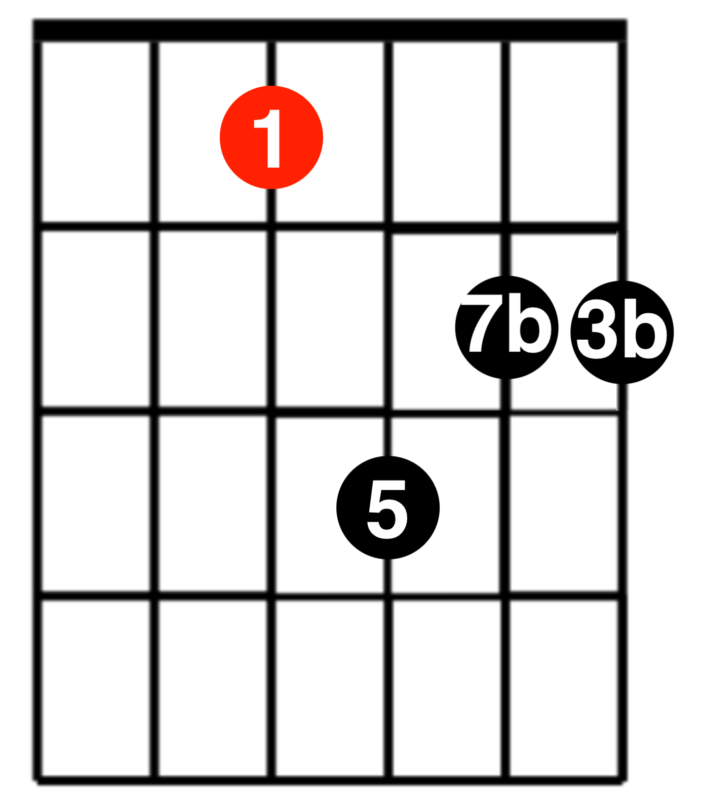
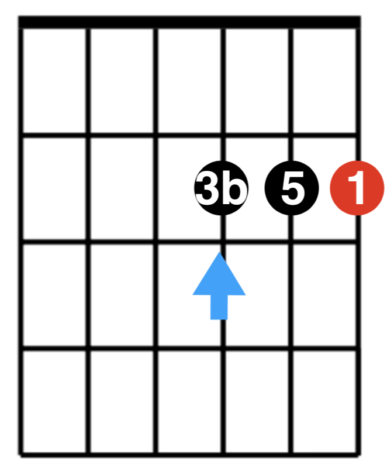

# 和弦推算记忆法

| 根音 | 指型        | maj                          | min                          | Dominant 7                  | min 7                         | maj 7                         |
| ---- | ----------- | ---------------------------- | ---------------------------- | --------------------------- | ----------------------------- | ----------------------------- |
| 6    | E           |  |  |  |  |  |
| 5    | A           |  |  |  |  |  |
| 5    | C           |  |                              |  |                               |                               |
| 4    | D           |  |  |  |  |  |
| 4    | F           |  |  |                             |                               |                               |
| 3    | Simple A    |    |    |                             |                               |                               |
| 2    | Simple D、C |    |    |                             |                               |                               |
| 1    | Simple F、E |    |    |                             |                               |                               |

## 参考
- [guitarrootssystem.com](http://guitarrootssystem.com/)
