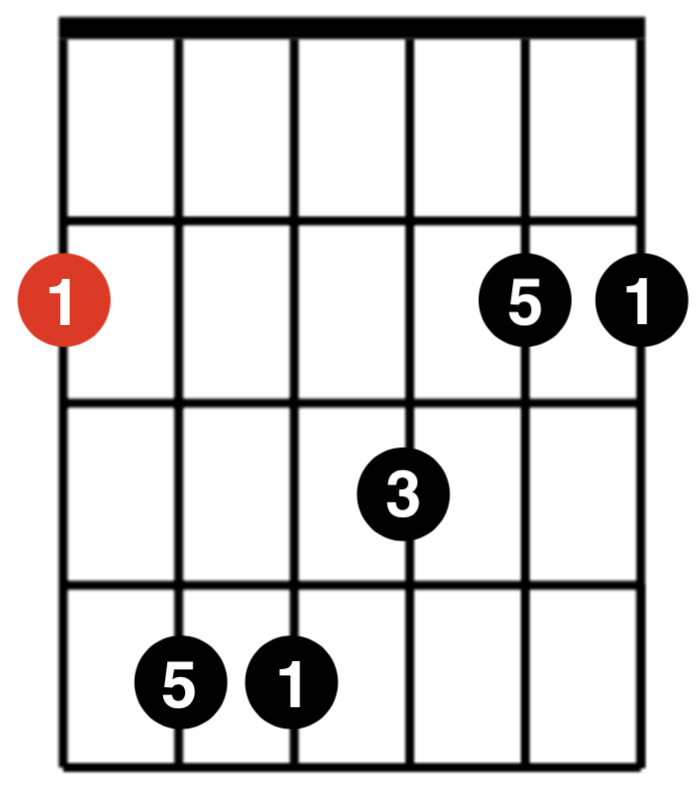
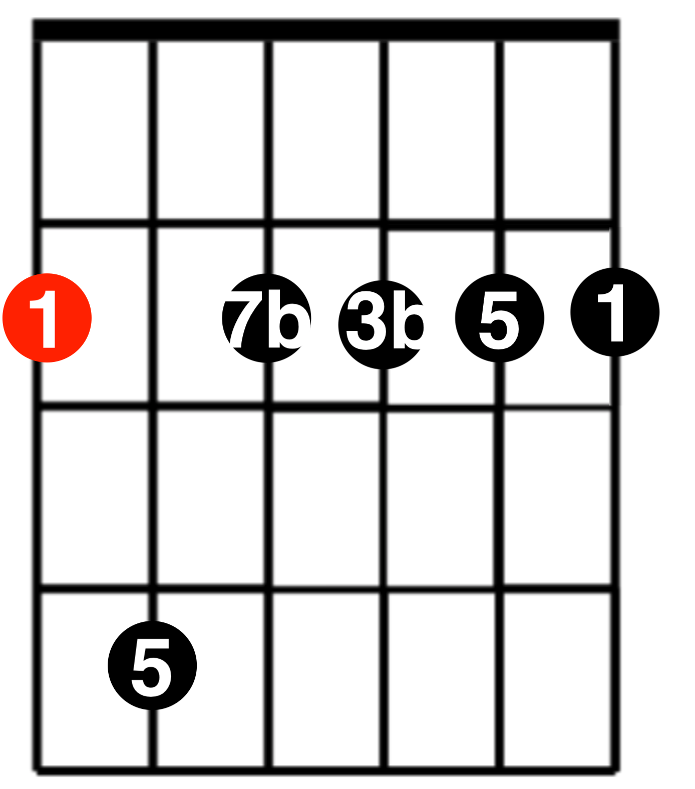
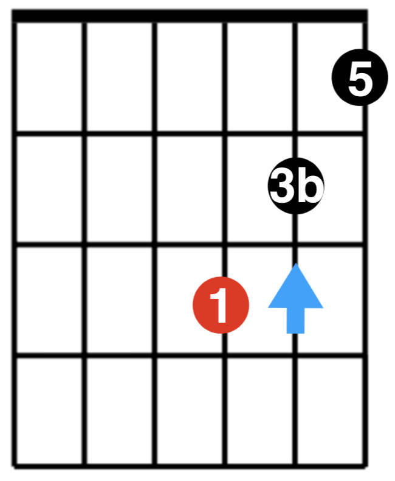
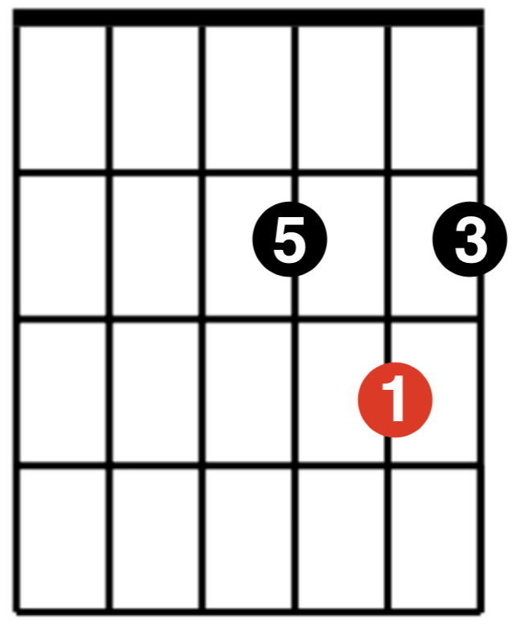

# 和弦推算记忆法

| 根音 | 指型        | Major                            | Minor                            | Dominant 7                    | Minor 7                           | Major 7                           |
| ---- | ----------- | -------------------------------- | -------------------------------- | ----------------------------- | --------------------------------- | --------------------------------- |
| 6    | E           |  |  |  |  |  |
| 5    | A           |  |  |  |  |  |
| 5    | C           |  |                                  |  |                                   |                                   |
| 4    | D           |  |  |  |  |  |
| 4    | F           |  |  |                               |                                   |                                   |
| 3    | Simple A    |      |      |                               |                                   |                                   |
| 2    | Simple D、C |      |      |                               |                                   |                                   |
| 1    | Simple F、E |      |      |                               |                                   |                                   |

## 参考
- [guitarrootssystem.com](http://guitarrootssystem.com/)
