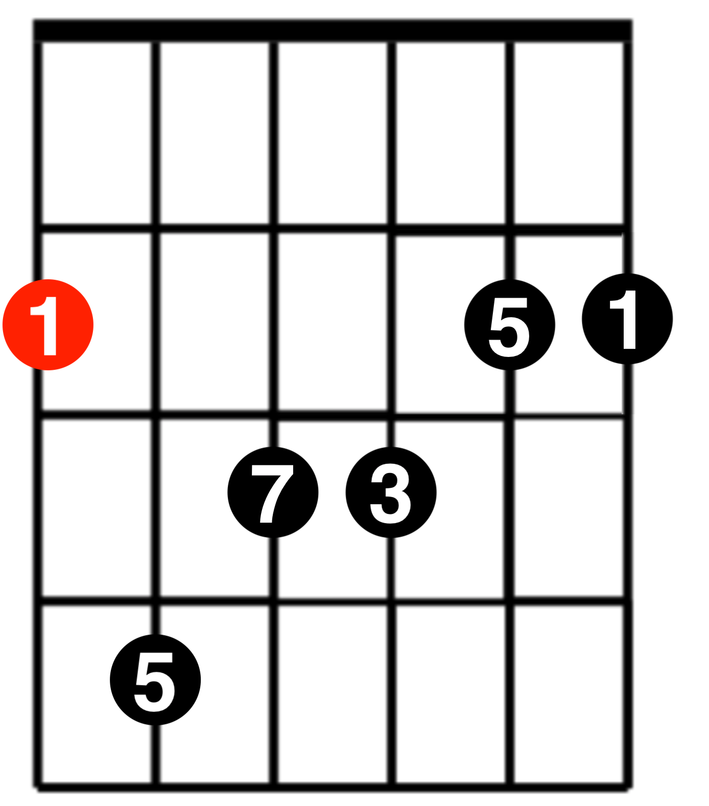
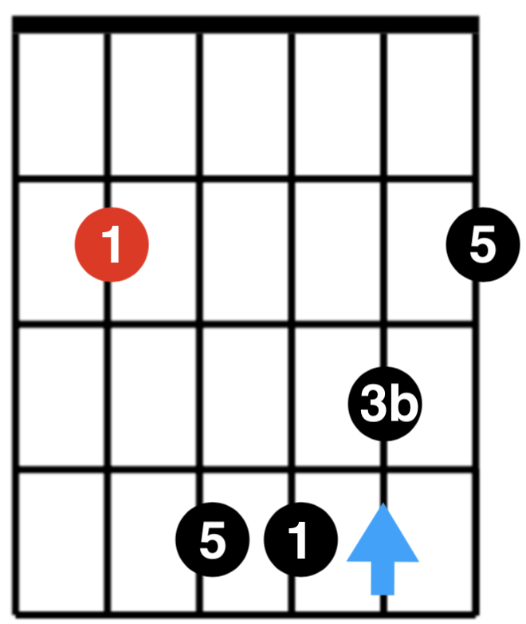
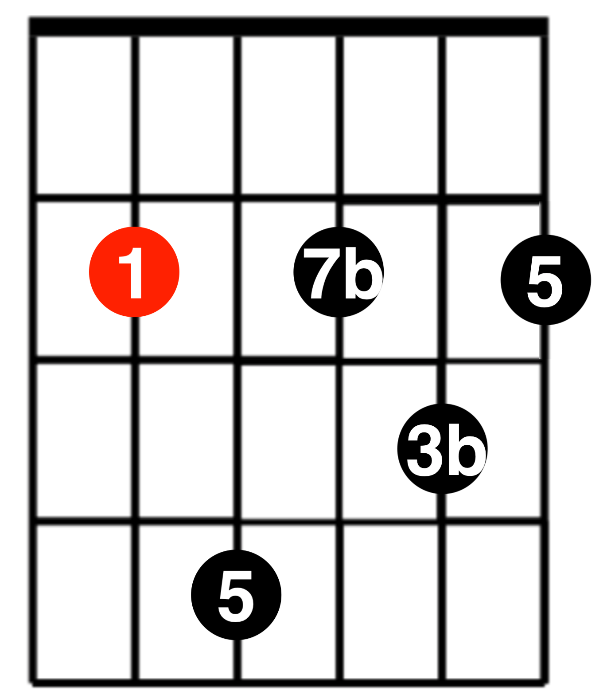
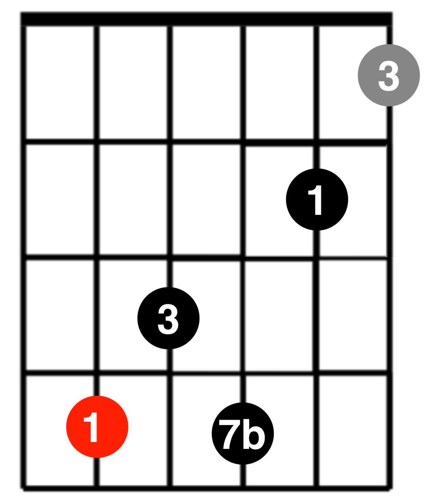

# 和弦推算记忆法

| 根音 | 指型         | Major                                          | Minor                                          | Dominant 7                                         | Minor 7                                         | Major 7                                         |
| ---- | ------------ | ---------------------------------------------- | ---------------------------------------------- | -------------------------------------------------- | ----------------------------------------------- | ----------------------------------------------- |
| 6    | E            |  |  |  |  |  |
| 5    | A            |  |  |  |  |  |
| 5    | C            |  |                                                |  |                                                 |                                                 |
| 4    | D            |  |  |  |  |  |
| 4    | F            |  |  |                                                    |                                                 |                                                 |
| 3    | 简易A        |            |            |                                                    |                                                 |                                                 |
| 2    | 简易D、简易C |            |            |                                                    |                                                 |                                                 |
| 1    | 简易F、简易E |            |            |                                                    |                                                 |                                                 |

## 参考
- [guitarrootssystem.com](http://guitarrootssystem.com/)
