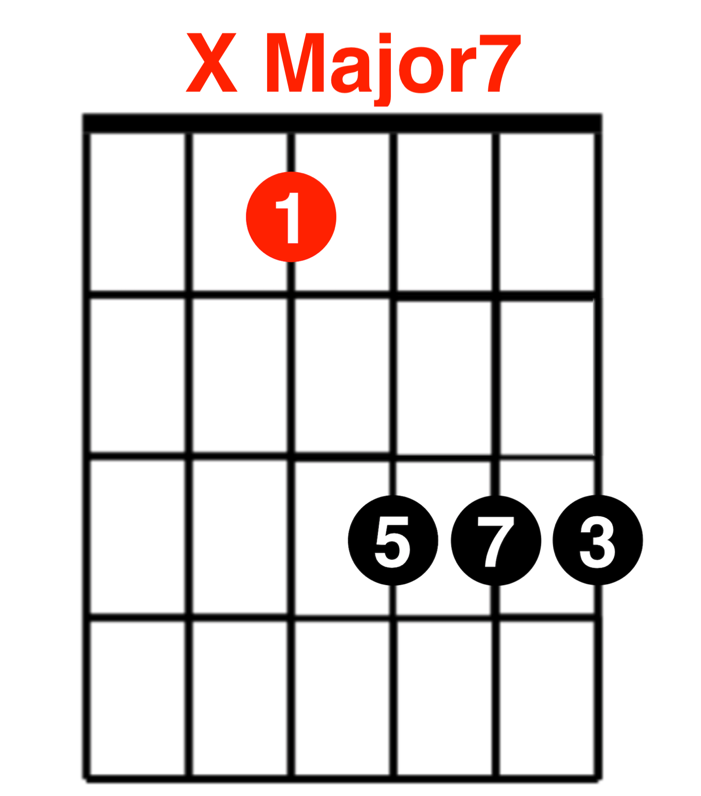

# 和弦推算记忆法

## 常用和弦

| Root | Pattern | X Major                | X minor               | X7                   | X Major7                | X minor7                |
| ---- | ------- | ---------------------- | --------------------- | -------------------- | ----------------------- | ----------------------- |
| -    | -       | 1 - 3 - 5              | 1 - b3 - 5            | 1 - 3 - 5 - b7       | 1 - 3 - 5 - 7           | 1 - b3 - 5 - b7         |
| 6    | E       |   |  |  |   |   |
| 6    | Simple  |  |                       |  |  |  |
| 5    | A       |   |  |  |   |   |
| 5    | C       |   |                       |  |                         |                         |
| 5    | Simple  |  |                       |  |  |  |
| 4    | D       |   |  |  |   |   |
| 4    | F       |   |  |                      |                         |                         |

## 特殊和弦

| Root | Pattern | X minor7-5                | X+ Augmented         | X- Diminished        |
| ---- | ------- | ------------------------- | -------------------- | -------------------- |
| -    | -       | 1 - b3 - b5 - b7          | 1 - 3 - #5           | 1 - b3 - b5 - bb7    | 
| 6    | Simple  |  |                      |                      |
| 5    | Simple  |  |  |                      |
| 4    | Simple  |                           |                      |  |

## 简易和弦

| Root | Pattern | X Major             | X minor             |
| ---- | ------- | ------------------- | ------------------- |
| -    | -       | 1 - 3 - 5           | 1 - b3 - 5          |
| 3    | Simple  |  |  |
| 2    | Simple  |  |  |
| 1    | Simple  |  |  |

## 参考
- [guitarrootssystem.com](http://guitarrootssystem.com/)
