# 和弦计算

| 根音 | 指型         | Major                                                | Minor                                                | Dominant 7                                               | Minor 7                                               | Major 7                                               |
| ---- | ------------ | ---------------------------------------------------- | ---------------------------------------------------- | -------------------------------------------------------- | ----------------------------------------------------- | ----------------------------------------------------- |
| 6    | E            | 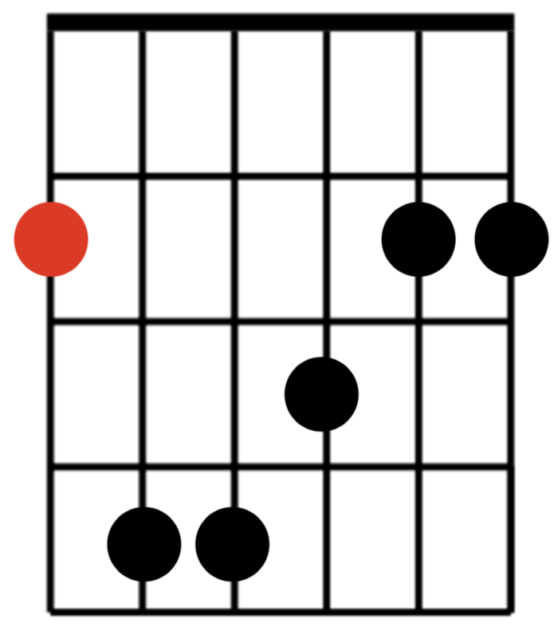 | 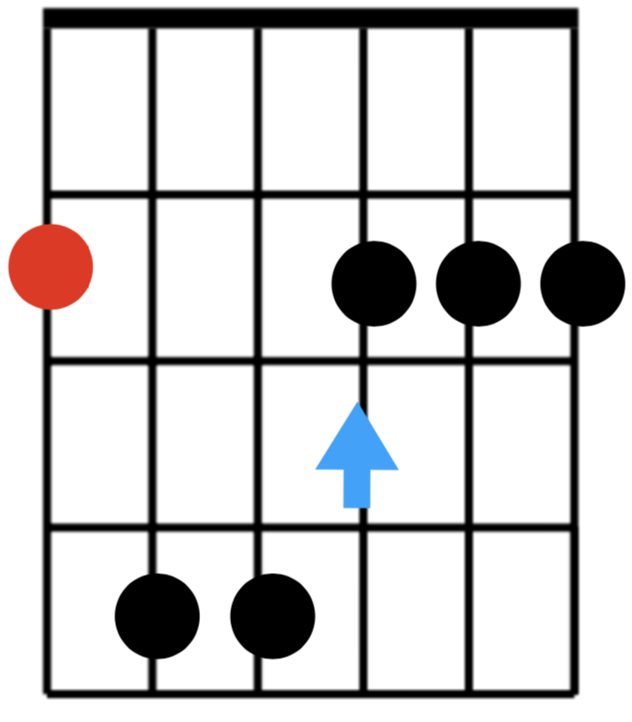 |  |  |  |
| 5    | A            | 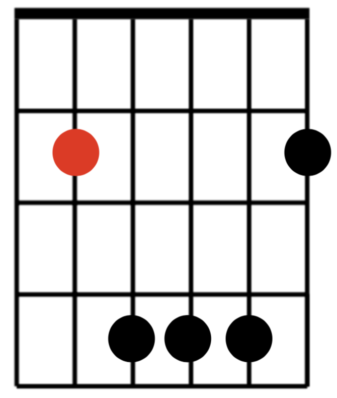 | 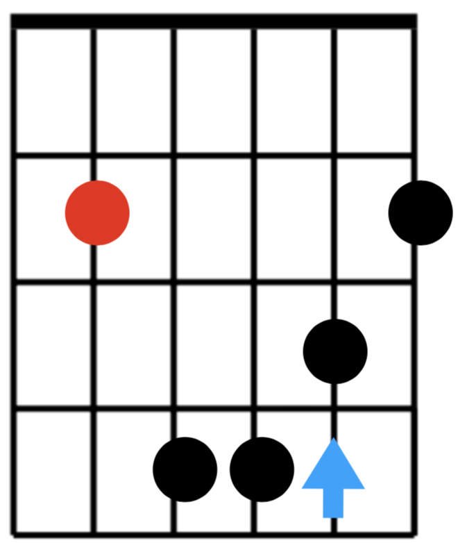 | 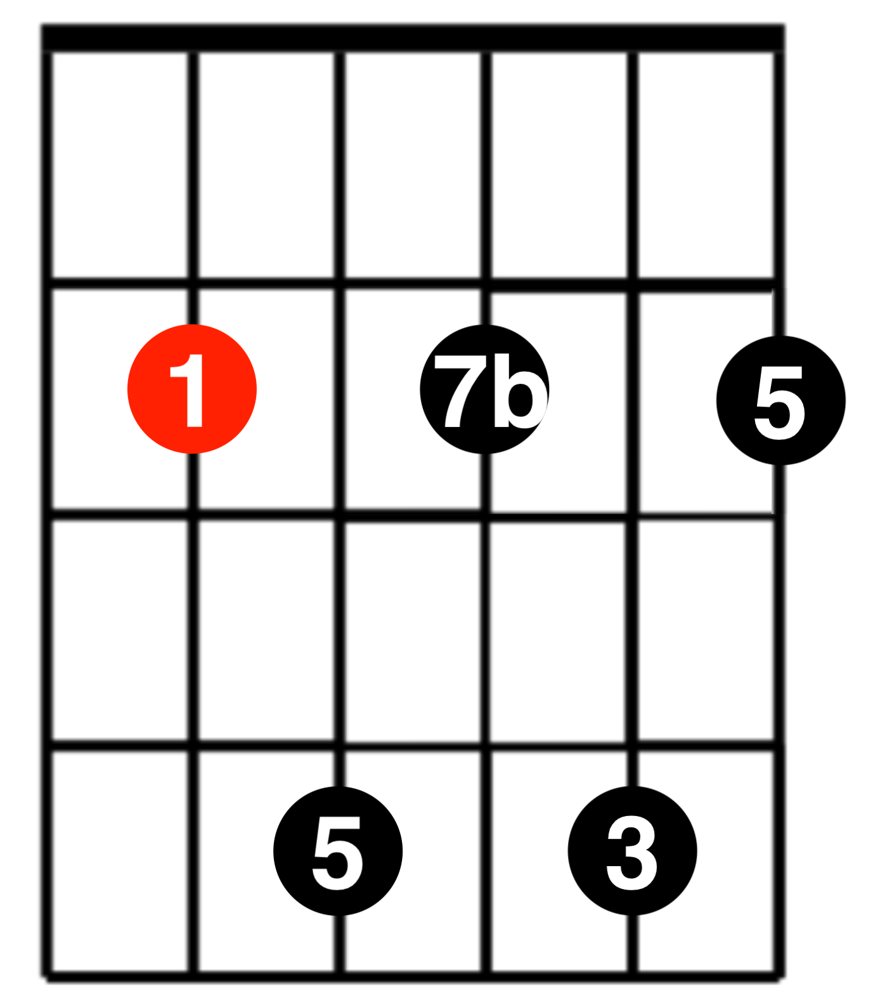 |  |  |
| 5    | C            | 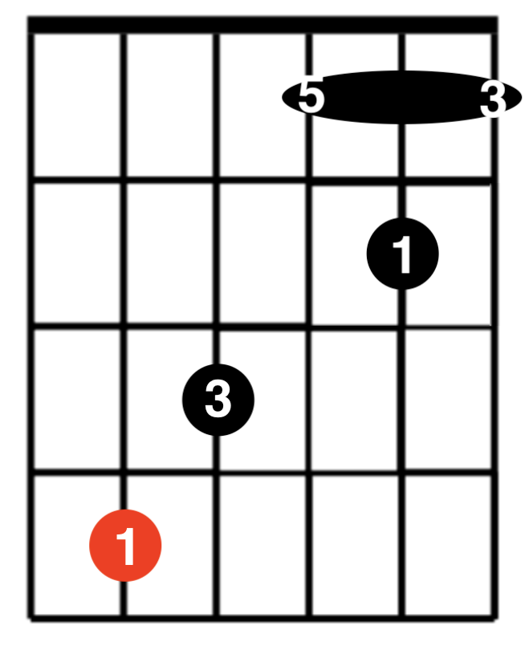 |                                                      |                                                          |                                                       |                                                       |
| 4    | D            | 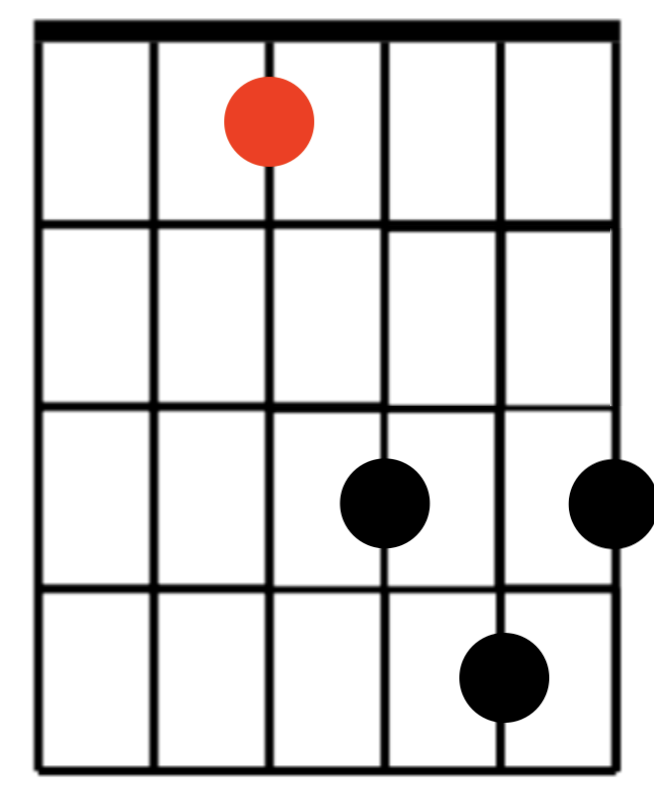 | 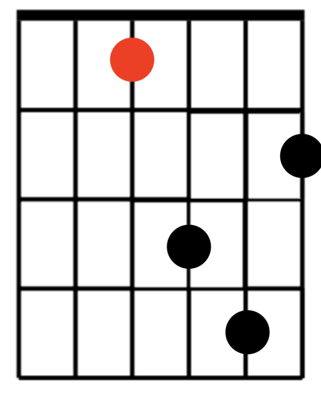 | 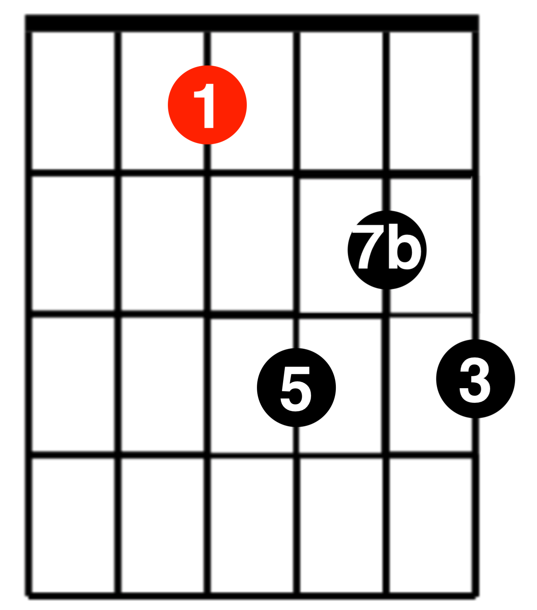 |  | 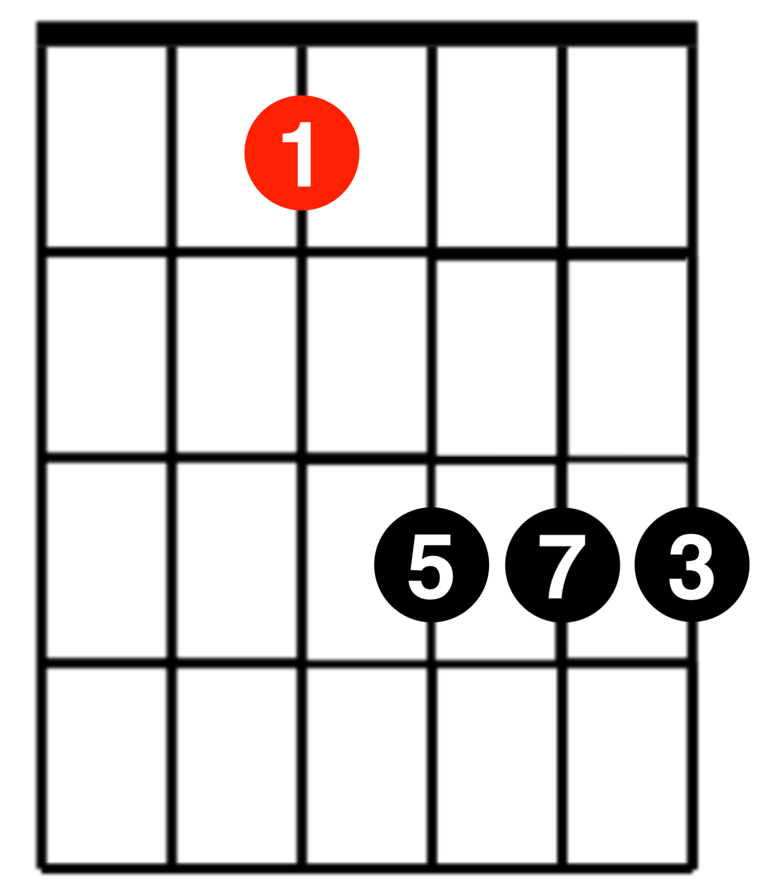 |
| 4    | F            | 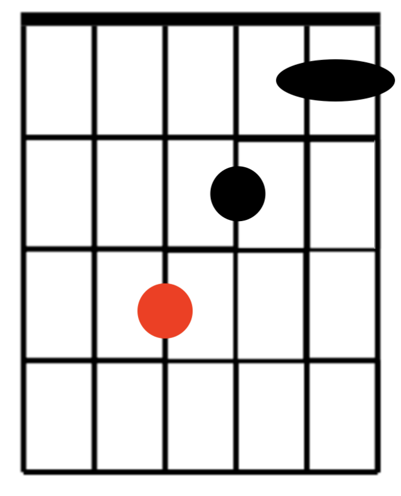 |  |                                                          |                                                       |                                                       |
| 3    | 简易A        | 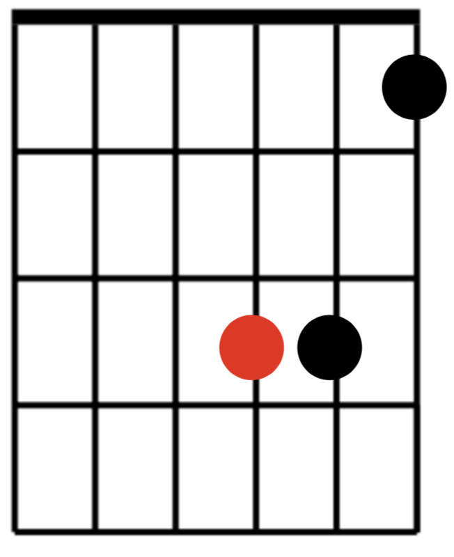           | 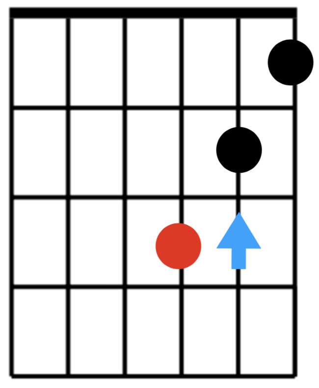           |                                                          |                                                       |                                                       |
| 2    | 简易D、简易C | 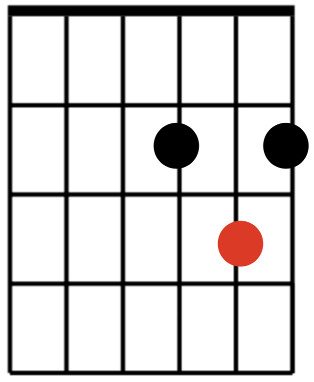           | 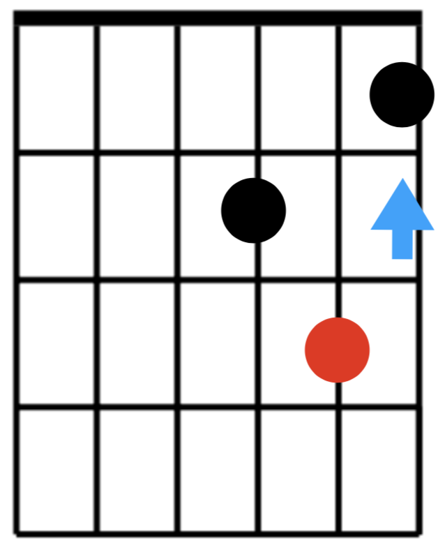           |                                                          |                                                       |                                                       |
| 1    | 简易F、简易E | 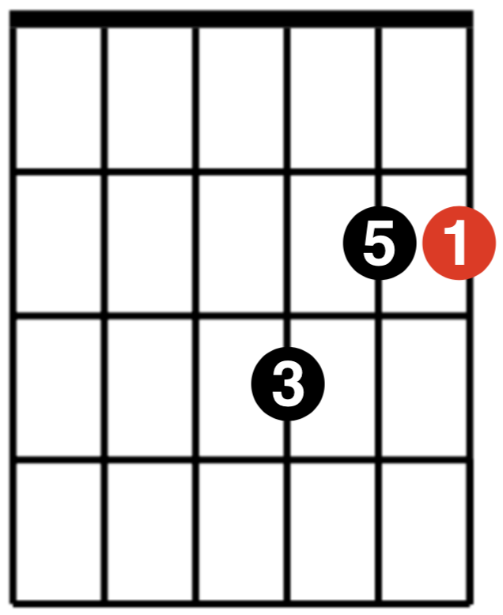           | 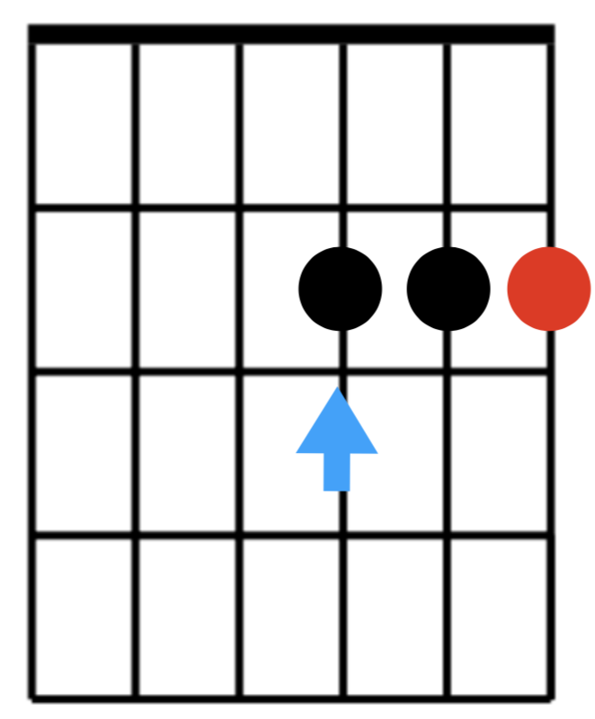           |                                                          |                                                       |                                                       |
