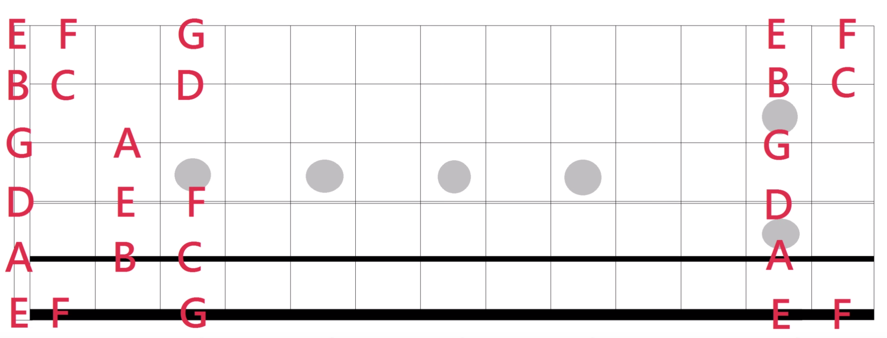
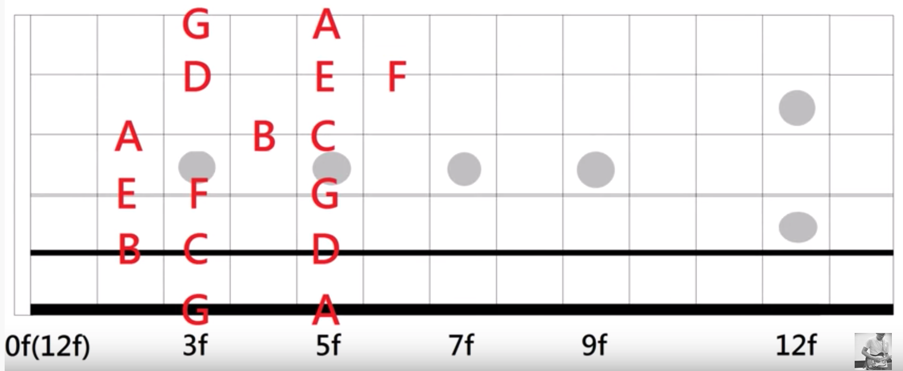
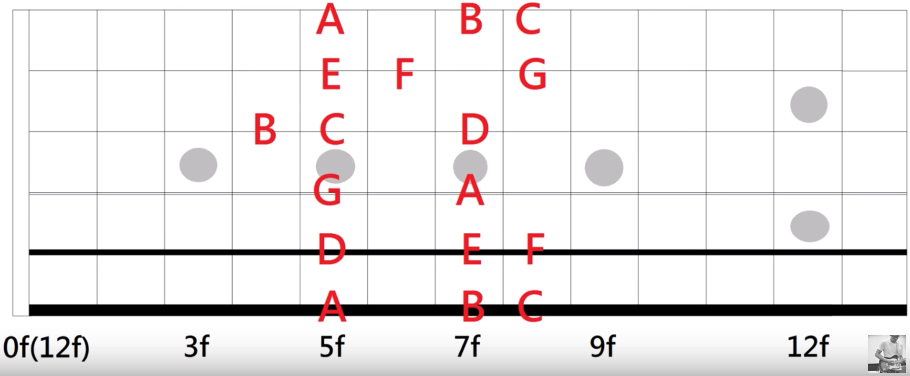
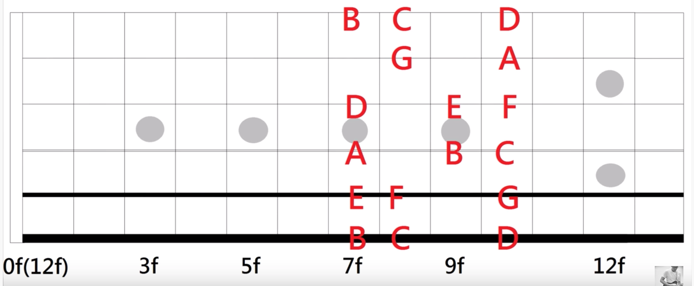
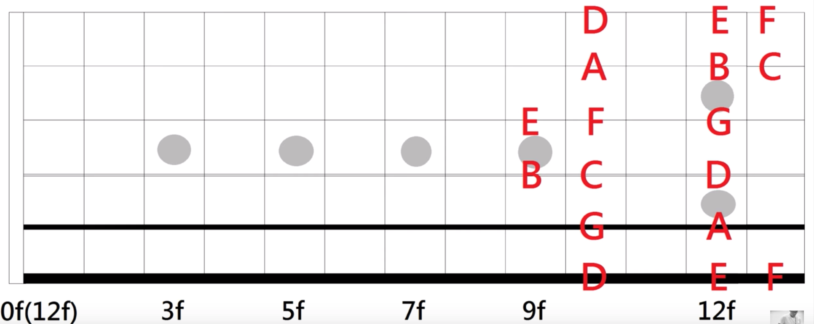

# 自然音阶指型

## Mi型

## Sol型

## La型

## Do型

## Re型

## 参考
- [葉宇峻彈吉他#34 自然音階指型mi型 Natural Scale Pattern](https://www.youtube.com/watch?v=6eNJ57_rDkA&feature=youtu.be)
- [葉宇峻彈吉他#42 自然音階指型sol型 Natural Scale Pattern](https://www.youtube.com/watch?v=tVkE5Ilvd8c&feature=youtu.be)
- [葉宇峻彈吉他#51 自然音階指型 La 型 Natural Scale Pattern](https://www.youtube.com/watch?v=tapF98425yY&feature=youtu.be)
- [葉宇峻彈吉他#65 自然音階指型 Do(Ti) 型 Natural Scale Pattern](https://www.youtube.com/watch?v=40oEkfKyyuc&feature=youtu.be)
- [葉宇峻彈吉他#83 自然音階指型Re型 Natural Scale Pattern](https://www.youtube.com/watch?v=tkPh-quvWro&feature=youtu.be)
