# 搞懂所有现代和弦记号

## 和弦

- 和弦 Chord: 三个音或以上的、三度堆叠的组合
- 三和弦 Triad：三个音的和弦
- 七和弦 Seventh Chord: 四个音的和弦
- 九和弦 Ninth Chord：五个音的和弦
- 十一和弦 Eleventh Chord：六个音的和弦
- 十三和弦 Thirteenth Chord：七个音的和弦

## 大小属

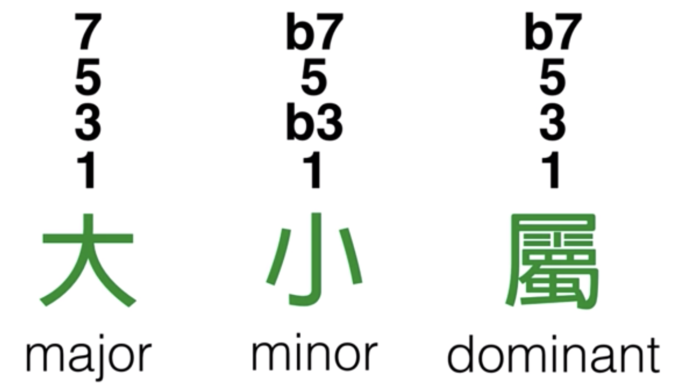

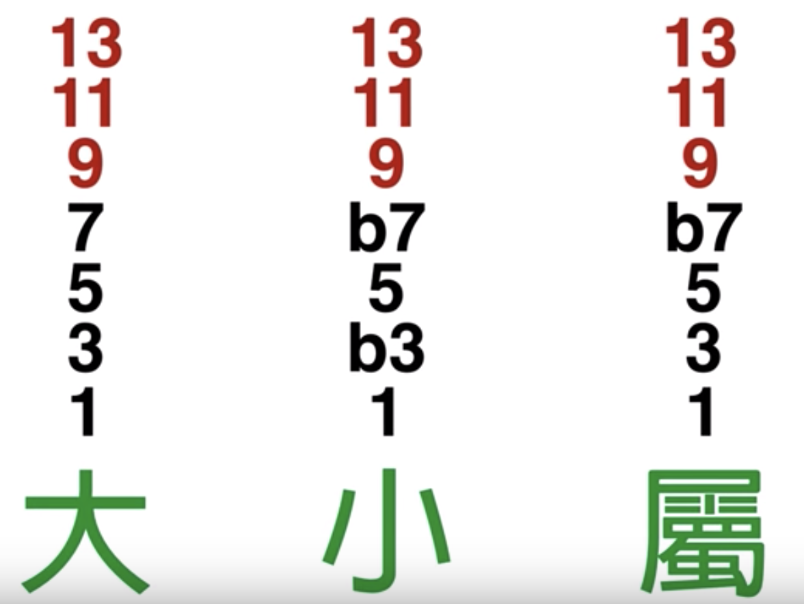

## 代号

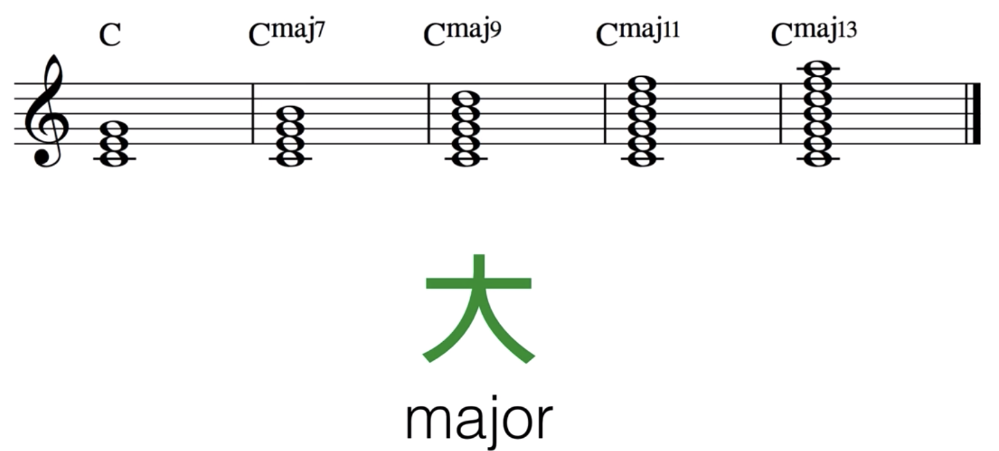

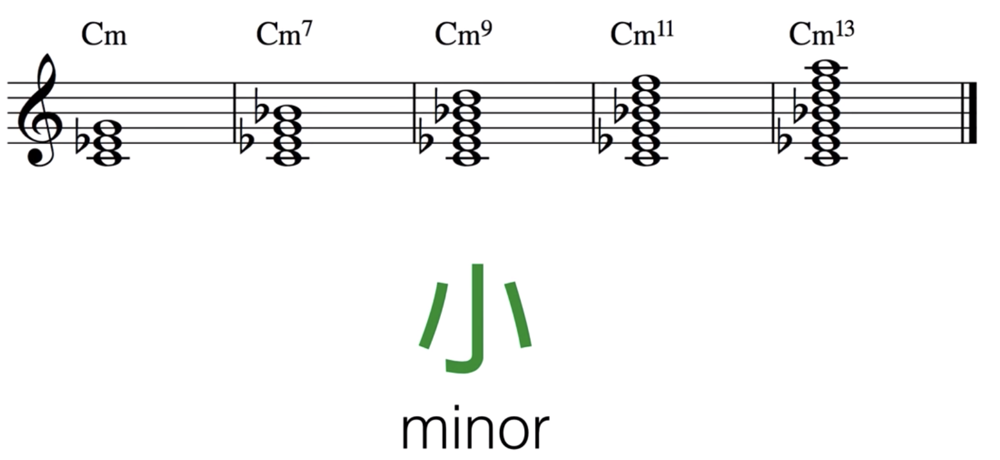

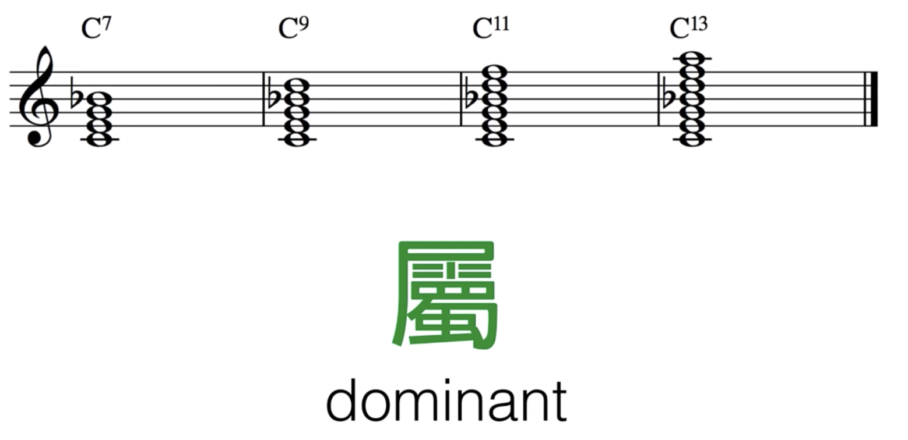

## 四种变化
### add 增加音

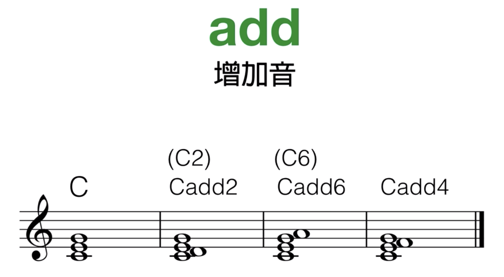

### sus

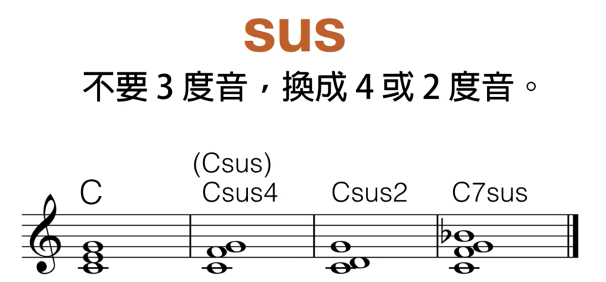

### omit

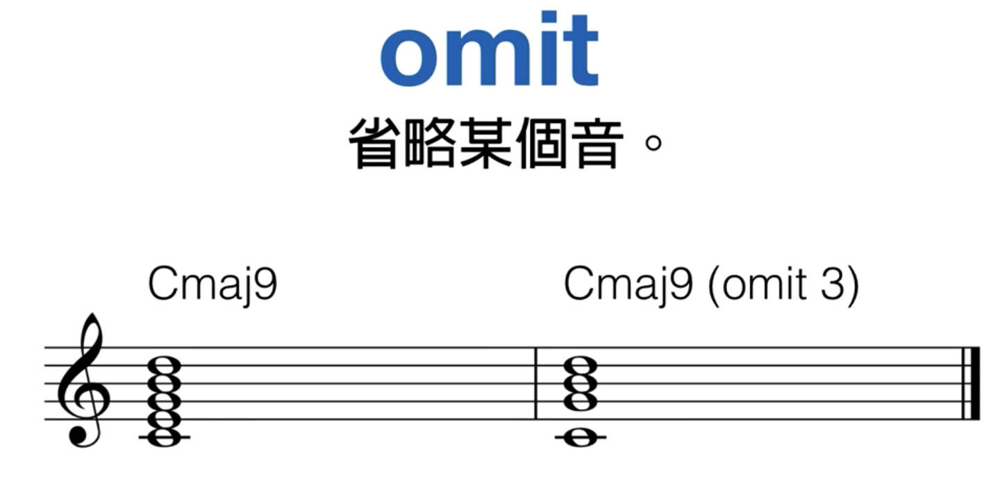

### ()

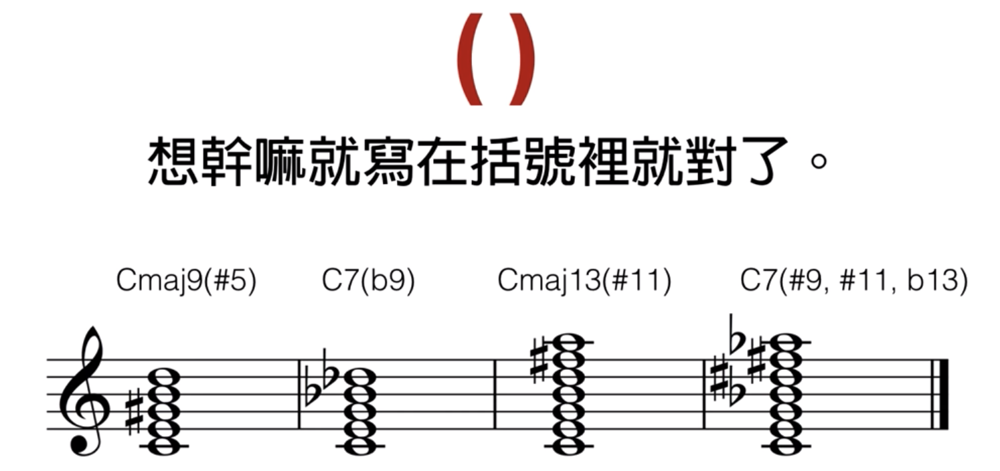

## 转位

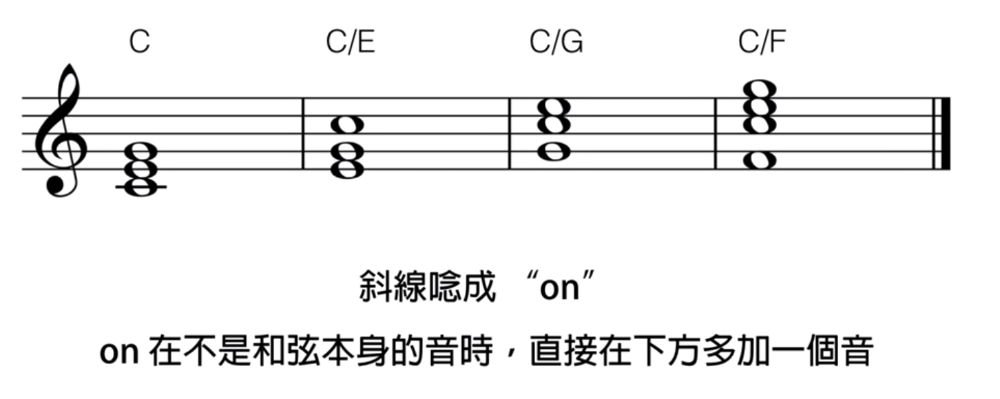

## 其他

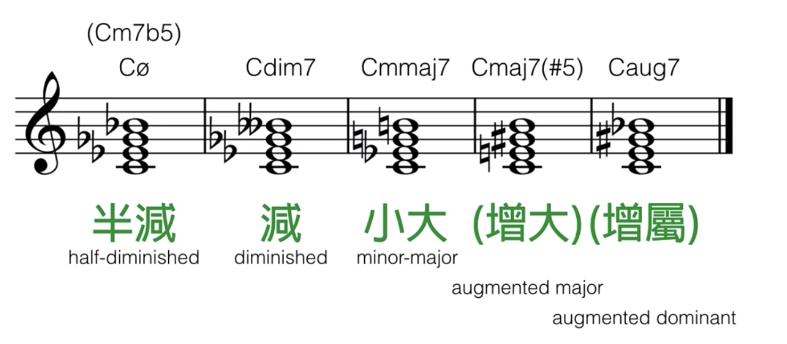

## 参考
- [十分鐘以內，一次搞懂所有的現代和弦代號！](https://www.youtube.com/watch?v=I0y2LY4sPZA)
