# 增减和弦的Triad按法

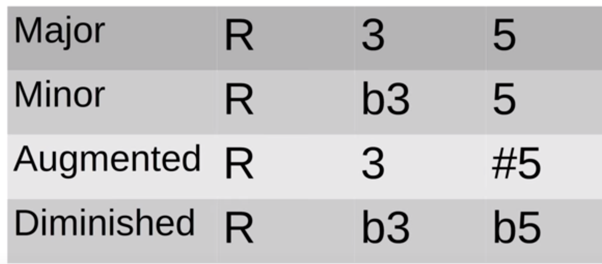

## Diminished

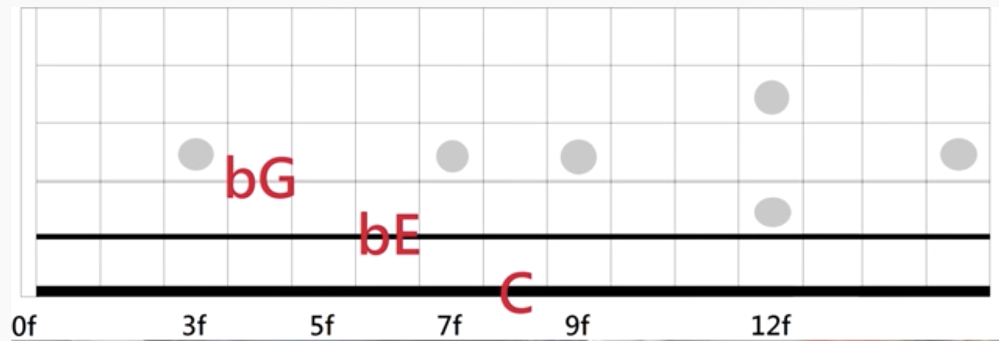

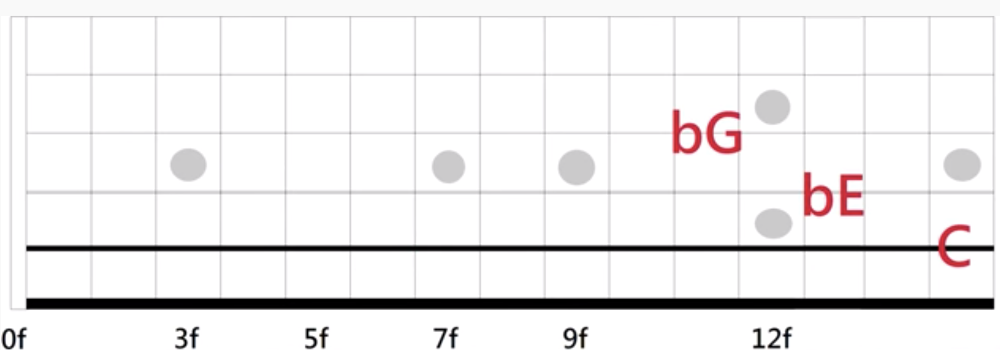

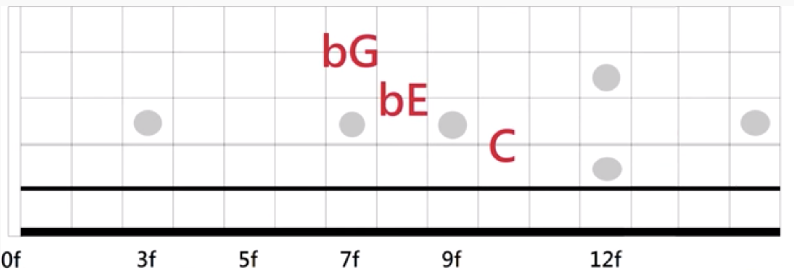

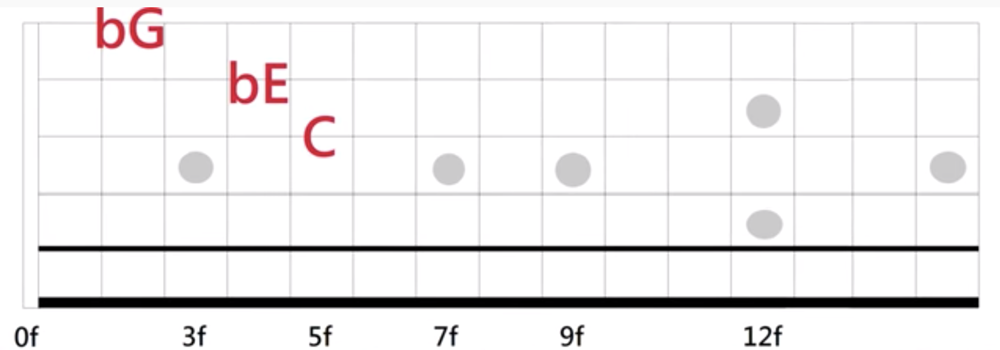

## Augmented

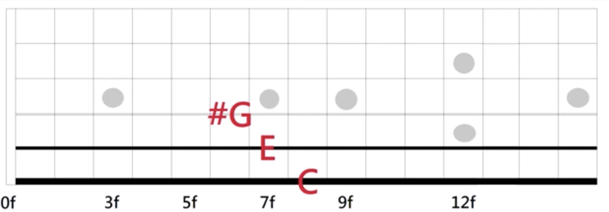

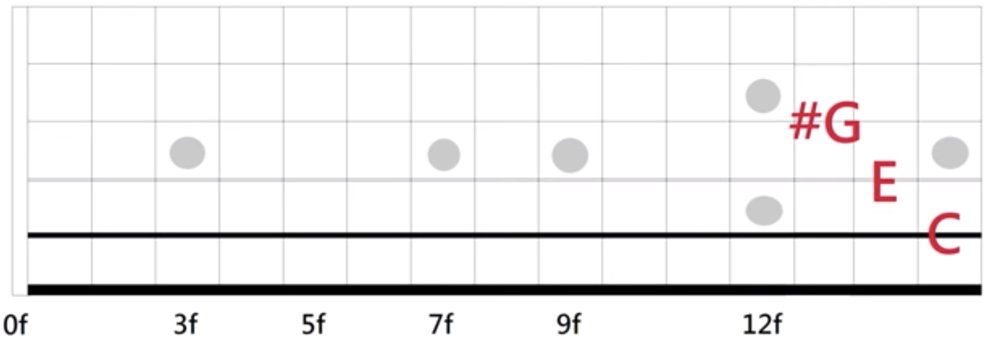

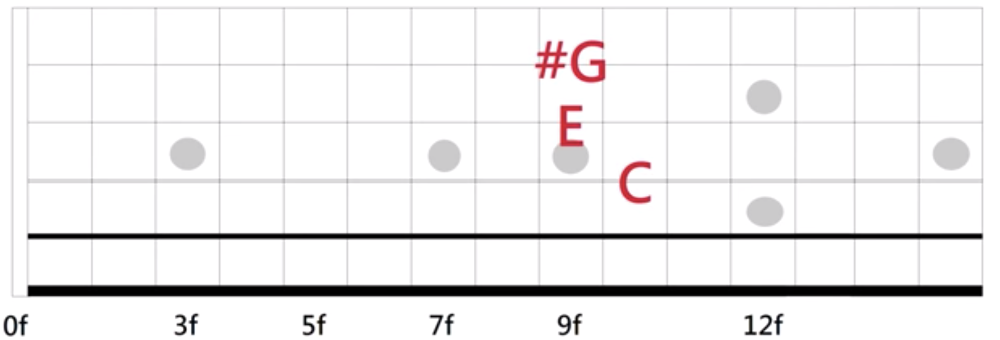

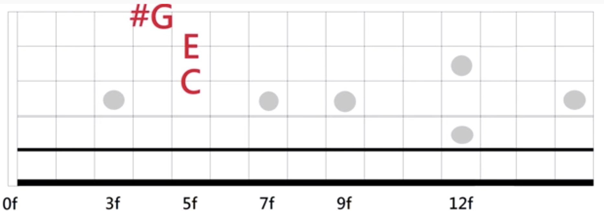

## 练习

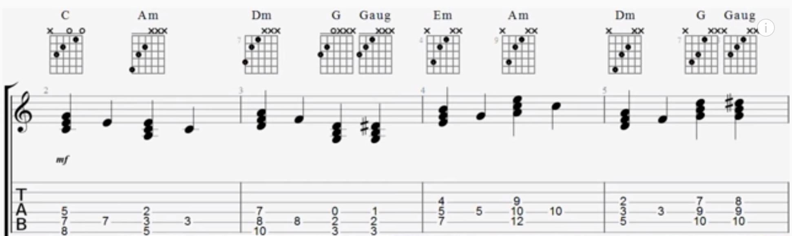

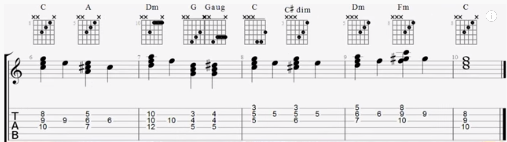

## 参考
- [葉宇峻彈吉他#35 減和弦及增和弦 Triad 型狀按法 How to Play Diminished & Augmented Triad on Guitar](https://www.youtube.com/watch?v=qTTuQoWboZU&feature=youtu.be)
- [葉宇峻彈吉他#36 大小增減三和弦綜合練習 major,minor,augmented,diminished triad lick](https://www.youtube.com/watch?v=IJ4n3qKyed0&feature=youtu.be)
