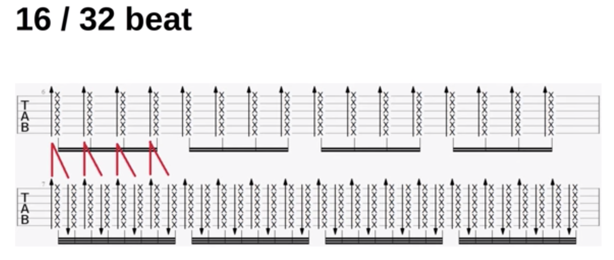
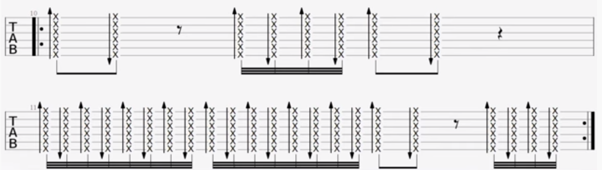
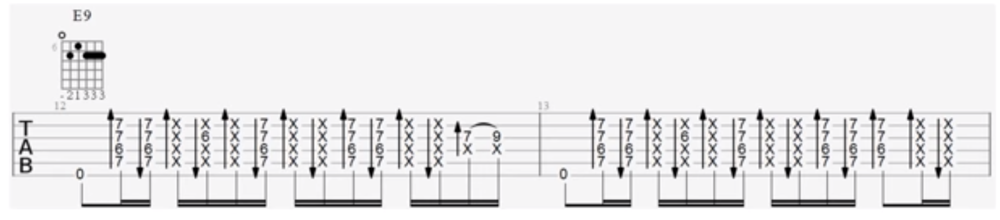
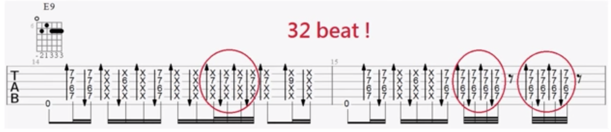

# 在刷弦节奏中加入32分音符

## 福克斯

## 16 beat funky groove

## 16 beat funky groove + 32 fill

## 参考
- [葉宇峻彈吉他#12 在刷和弦彈奏中加入32分音符的變化 32 beat funky strum](https://www.youtube.com/watch?v=8Fd6U6bpb-E&feature=youtu.be)
