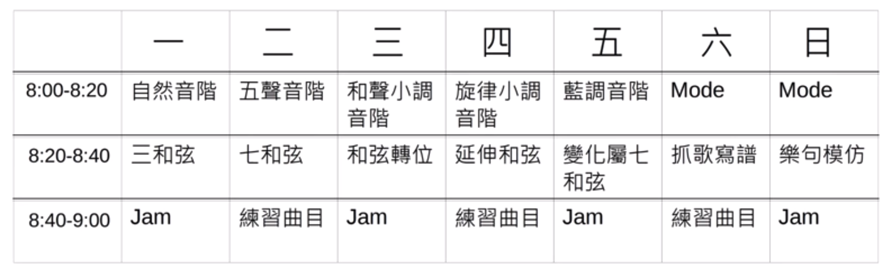

#  吉他练习日课表

## 音階
- 5 傳統五聲音階的進階應用 https://youtu.be/6mcRUsDg_jk
- 13 自然音階指型記憶法 https://youtu.be/7D_GQxILRWg
- 15 八度音的彈奏應用及悶音技巧 https://youtu.be/06KXRxGKKf8
- 28 要如何增加速度?直線音階的Picking練習 https://youtu.be/o1RNz-Dx1OU
- 34 自然音階指型mi型 https://youtu.be/6eNJ57_rDkA
- 42 自然音階指型sol型 https://youtu.be/tVkE5Ilvd8c
- 51 自然音階指型 La 型 https://youtu.be/tapF98425yY
- 54 很實用的"六度雙音"手法 https://youtu.be/_fqO8oqv_CU
- 57 如何彈藍調?小調五聲音階篇 https://youtu.be/l4ILK38ZEtk
- 60 用大調五聲音階彈藍調 https://youtu.be/ADYKImrpDmI
- 61 很酷的三度音手法 https://youtu.be/I0Y_86cYRDU
- 65 自然音階指型 Do(Ti) 型 https://youtu.be/40oEkfKyyuc
- 83 自然音階指型Re型 https://youtu.be/tkPh-quvWro
- 97 Legato大絕招教學 https://youtu.be/_b8FEjp7zEM

##  和弦
- 6 國際四和弦加延伸音教學 https://youtu.be/CA-3JwCcMWw
- 9 吉他移動式和弦加空弦的應用 https://youtu.be/6Tn7eKo2MdA
- 11 破解指板上全部自然泛音並彈奏和弦 https://youtu.be/B0GniMDhGgw
- 14 爵士藍調和弦行進及彈奏 https://youtu.be/86Z0EOyHRIA
- 20 封閉和弦快速推算法 https://youtu.be/-buWomeh-_U
- 21 用標準調音彈出像降弦或七弦強力和弦的聲音 https://youtu.be/XshHm5uADDM
- 22 看"回到未來"學藍調 https://youtu.be/K2qb93hAfWc
- 23 C和弦的基本六種按法 https://youtu.be/9MSbllQNW14
- 25 Am的基本六種按法 https://youtu.be/FfbP0ZlVde4
- 26 如何抓歌之順階三和弦篇 https://youtu.be/u2SamZwbbE8
- 29 流行歌常用和絃進行之12個調性下的彈法 https://youtu.be/sTUHLetwXqY
- 35 減和弦及增和弦 Triad 型狀按法 https://youtu.be/qTTuQoWboZU
- 36 大小增減三和弦綜合練習 https://youtu.be/IJ4n3qKyed0
- 32 如何由和弦進行判斷調性 https://youtu.be/A_XhEo0cK-0
- 45 用和弦重組彈"生日快樂歌" https://youtu.be/ObadBnaFb5Q
- 50 吉他上的"一條線和弦" https://youtu.be/fmAJF-x5jQs
- 53 吉他上長得像 "四邊形的和絃"  https://youtu.be/Y9kcUATT4PA
- 56 如何彈藍調?和弦進行篇 https://youtu.be/aCcHa2ZawAk
- 58 如何按好封閉和弦? https://youtu.be/nNQVh7njzM0
- 62 三角形和弦 https://youtu.be/tj-06p_kXMI
- 79 找出和弦按法?  https://youtu.be/AwZpKH7OEaU
- 89 和弦重組 "恭喜恭喜" https://youtu.be/dQVX3kkOr1w
- 96 6和弦及69和弦的應用 https://youtu.be/qgDycxf9fo0

##  節奏
- 2 打板並延音技巧教學 https://youtu.be/ElDYdJ7lBfw
- 3 三連音刷弦手法 https://youtu.be/VcyS8hc4HoE
- 4 "敲擊節奏教學 讓吉他聽起來像爵士鼓 https://youtu.be/IfBnJerEVOQ
- 12 在刷和弦彈奏中加入32分音符的變化 https://youtu.be/8Fd6U6bpb-E
- 24 16分音符的6種基本應用節奏刷法 https://youtu.be/1Qr8mjeZNQE
- 30 拍子遊戲之如何算兩拍三連音 https://youtu.be/QlANfTtBYfk
- 46 三連音連發刷弦法 https://youtu.be/8PmboJqVsNw
- 48 三連音連發刷弦法 part-2 https://youtu.be/CJvKQ1KJSxA
- 74 彈吉他常見的錯誤動作 - 換和弦間偷半拍 https://youtu.be/6mSjA12BI80
- 82 刷和弦時常見錯誤動作 https://youtu.be/t5tSnnog_tw

##  jam
- 7 使用Triad三和弦音階即興solo https://youtu.be/wsNJONwutkc
- 8 台式流行歌伴奏法 https://youtu.be/vV8kpk2HD8M
- 10 如何練習即興演奏 https://youtu.be/M27zd7DVar4
- 16 如何練習即興演奏2-由五聲音階設計樂句 https://youtu.be/RUWzsxe0G7A
- 63 爵士樂251樂句教學 https://youtu.be/7rHfoHQjXtg
- 64 爵士樂251樂句教學2 https://youtu.be/RzLRMig4t6w
- 90 爵士樂251樂句教學 3 https://youtu.be/i8K8w8xaV0Q

##  曲目、技巧及知識
- 1 Fight 教學https://youtu.be/RmFbP0T-K24
- 37 Fight 教學part 2 https://youtu.be/GAKDSIXaygg
- 38 Fight 教學part 3 https://youtu.be/VatTlJQ9GZw
- 39 Fight 教學part 4 https://youtu.be/ogGXjhRhO94
- 17 如何看懂"做場用的譜" https://youtu.be/gAWtK4I1spM
- 18 放克吉他技巧20招  https://youtu.be/yI85zEVBTG8
- 19 單弦點弦技巧 https://youtu.be/qWJtCnByeGA
- 27 如何編Fingerstyle吉他演奏曲 - 旋律及根音篇 https://youtu.be/YuXGnv7hFs0
- 31 基礎2弦掃弦教學 2 https://youtu.be/Hi0KAKbi3WY
- 33 擊弦泛音技巧教學 https://youtu.be/_wsy0StRnHI
- 40 請問這個怎麼彈?邊彈邊打板的指彈技巧 https://youtu.be/0K43MULeuxY
- 41t 윤미래 Yoon Mi Rae - ALWAYS https://youtu.be/U1HpS85jCNc
- 43 要如何抓歌之心法篇 https://youtu.be/r5rP9s4g6-k
- 44 CHEN(첸)XPunch(펀치) _ Everytime https://youtu.be/a_S1elazIQc
- 47 用電吉他solo 羅瑩雪 "然後他就死掉了" https://youtu.be/8mL_fm2DJHQ
- 49 Red Hot Chili Peppers - Dark Necessities https://youtu.be/2UD_AJ0vKfk
- 52 MAYDAY五月天 - 派對動物 https://youtu.be/qaFQp-fKXkM
- 55 如何看譜轉調? https://youtu.be/TScX_mR87Sk
- 59 顫音技巧教學 https://youtu.be/b8wQCCNddIM
- 66 李榮浩 - 不說 https://youtu.be/zT7PZtLjE6Y
- 67 楊丞琳 - 年輪說 https://youtu.be/V_4o__CLNzE
- 68 Sia - The Greatest https://youtu.be/If8UXEAc46k
- 69 伴奏也是可以很秋der https://youtu.be/TGibopre80s
- 70 The Chainsmokers - Closer https://youtu.be/utAgUF8MofQ
- 71 PPAP https://youtu.be/p9UDlQKzb6Y
- 72 PPAP 吉他教學 https://youtu.be/fn33AmpTa6A
- 73 Lady Gaga - Million Reasons https://youtu.be/PkntQmo8Lyo
- 75 來刷個 Funky 樂句吧! https://youtu.be/KyNPggwcbBE
- 76 推弦教學 https://youtu.be/xXbTmBqeWAo
- 77 十種"五月天-擁抱"的彈法 https://youtu.be/H72t3JwS8EA
- 78 TAEYEON/태연 - 11:11 https://youtu.be/E_rUcWjimVg
- 80 破音效果器用法  https://youtu.be/fIrXXzxC85c
- 81 不用掃弦也可以彈出掃弦的"跨弦"技巧  https://youtu.be/iGivY5H4Qfc
- 84 徒手剪吉他弦教學 https://youtu.be/yoe7Uk3PAQ4
- 85 相對音與絕對音!?  https://youtu.be/6q7TL3potDc
- 86 讓根音更有貝斯感之悶音技巧教學 https://youtu.be/yppCO3IPPgA
- 87 Ed Sheeran - Castle On The Hill https://youtu.be/Rmi17A1ecC8
- 88 指法伴奏的小心機 https://youtu.be/hUdGlKzRTy4
- 91 史上最便宜的滑管 Slide https://youtu.be/7BlDA_H9JrM
- 92 那些年，我們一起追的女孩 吉他演奏譜 https://youtu.be/eRkDRLYpFrg
- 93 Chorus 水聲/和聲效果器教學 https://youtu.be/4REmfZkJT3Y
- 94 人工泛音技巧六大重點教學 https://youtu.be/NWLkep_6JgM
- 95 關於吉他的20個英文單字 https://youtu.be/IqK0S8ks5DY
- 98 不同種類的破音效果器，甘有差? https://youtu.be/QfBZPlsZGrY

##  参考
- [吉他練習日課表【葉宇峻彈吉他- 99】](https://www.youtube.com/watch?v=lJqQNyccYZU&list=PL7yZwNs7cH5QmdGvL7XtnoQ6VAsDfjBXH&index=121&t=0s)
